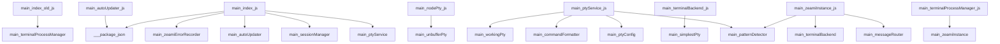

# Dependency Graph

```mermaid
graph TD
    main_autoUpdater_js --> ___package_json
    main_index_old_js --> main_terminalProcessManager
    main_index_js --> main_ptyService
    main_index_js --> main_sessionManager
    main_index_js --> main_autoUpdater
    main_index_js --> main_zeamiErrorRecorder
    main_index_js --> ___package_json
    main_nodePty_js --> main_unbufferPty
    main_ptyService_js --> main_ptyConfig
    main_ptyService_js --> main_patternDetector
    main_ptyService_js --> main_commandFormatter
    main_ptyService_js --> main_workingPty
    main_terminalBackend_js --> main_simplestPty
    main_terminalProcessManager_js --> main_zeamiInstance
    main_zeamiInstance_js --> main_messageRouter
    main_zeamiInstance_js --> main_patternDetector
    main_zeamiInstance_js --> main_terminalBackend
```