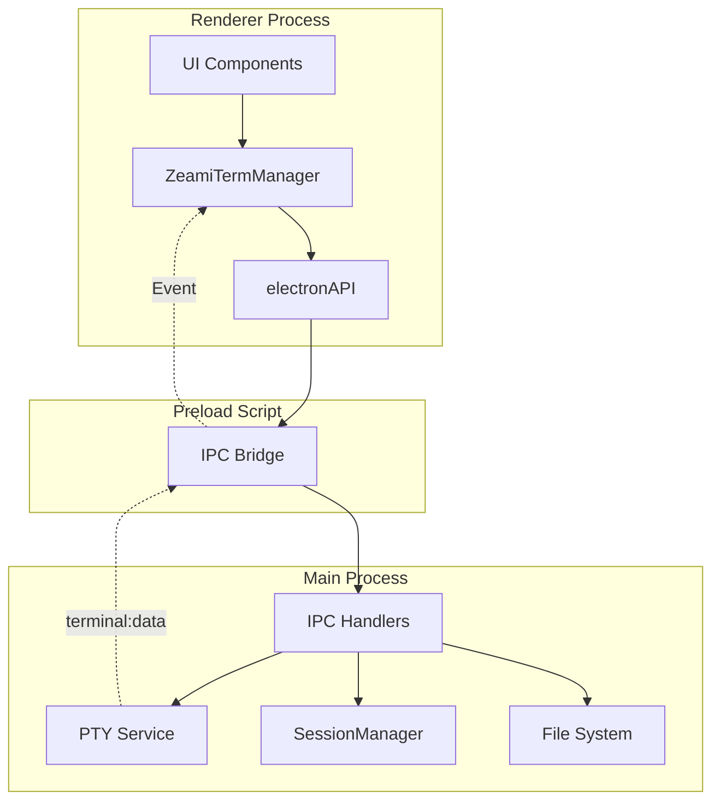

# IPC通信設計

> 🤖 **Claude Code最適化ドキュメント**  
> ZeamiTermのプロセス間通信を完全網羅。新機能追加時の必須リファレンス。

## 🎯 クイックリファレンス

| やりたいこと | 使用するチャンネル | 実装例 |
|------------|------------------|--------|
| 新規ターミナル作成 | `terminal:create` | [ターミナル管理](#1-ターミナル管理) |
| コマンド実行を追跡 | `command:trackStart/End` | [コマンド追跡](#8-コマンド追跡) |
| 通知を表示 | `show-notification` | [通知・メッセージ](#7-通知メッセージ) |
| ファイルを保存 | `file:save` | [ファイル操作](#4-ファイル操作) |
| セッション永続化 | `session:save/load` | [セッション管理](#2-セッション管理) |

## 📊 通信アーキテクチャ



## 📡 IPC通信チャンネル詳細

### 1. ターミナル管理

#### `terminal:create` 📤 Renderer→Main
新規ターミナルセッションを作成

```javascript
// 📍 使用例: src/renderer/core/ZeamiTermManager.js:156
const result = await window.electronAPI.createTerminal({
    shell: '/bin/bash',
    cwd: process.cwd(),
    env: process.env,
    cols: 80,
    rows: 24
});
// 戻り値: {success: true, id: "terminal-a", pid: 12345, shell: "/bin/bash", cwd: "/home/user"}
```

#### `terminal:data` 📥 Main→Renderer
ターミナル出力データの受信

```javascript
// 📍 リスナー登録: src/renderer/core/ZeamiTermManager.js:234
window.electronAPI.onTerminalData((data) => {
    // data: {id: "terminal-a", data: "Hello World\r\n"}
    const terminal = this.terminals.get(data.id);
    terminal.write(data.data);
});
```

#### `terminal:input` 📤 Renderer→Main
ユーザー入力の送信

```javascript
// 📍 使用例: src/renderer/core/ZeamiTerminal.js:123
await window.electronAPI.sendInput({
    id: this.terminalId,
    data: userInput  // キー入力やペーストデータ
});
```

#### `terminal:resize` 📤 Renderer→Main
ターミナルサイズ変更

```javascript
// 📍 使用例: src/renderer/core/SimpleLayoutManager.js:234
await window.electronAPI.resizeTerminal({
    id: terminalId,
    cols: newCols,
    rows: newRows
});
```

### 2. セッション管理

#### `session:save` 📤 Renderer→Main
現在のセッション状態を保存

```javascript
// 📍 使用例: src/renderer/core/ZeamiTermManager.js:678
const sessionData = {
    terminals: Array.from(this.terminals.entries()).map(([id, term]) => ({
        id,
        buffer: term.serialize(),
        cwd: term.cwd
    })),
    layout: this.layoutManager.getState(),
    timestamp: Date.now()
};
await window.electronAPI.saveSession(sessionData);
```

#### `session:restore` 📥 Main→Renderer
保存されたセッションの復元通知

```javascript
// 📍 リスナー登録: src/renderer/core/ZeamiTermManager.js:234
window.electronAPI.onSessionRestore((data) => {
    this.restoreSession(data);
});
```

### 3. プロファイル管理

#### `profiles:get` 📤 Renderer→Main
プロファイル一覧取得

```javascript
// 📍 使用例: src/renderer/features/ProfileManager.js:45
const profiles = await window.electronAPI.getProfiles();
// 戻り値: [{id: "default", name: "Default", shell: "/bin/bash", env: {}}]
```

### 4. ファイル操作

#### `file:save` 📤 Renderer→Main
ファイル保存ダイアログ

```javascript
// 📍 使用例: src/commands/save.js:23
const result = await window.electronAPI.saveFile({
    content: terminalContent,
    defaultFilename: 'terminal-output.txt',
    filters: [
        { name: 'Text Files', extensions: ['txt'] },
        { name: 'All Files', extensions: ['*'] }
    ]
});
// 戻り値: {success: true, path: "/home/user/terminal-output.txt"}
```

### 5. ウィンドウ管理

#### `toggle-fullscreen` 📤 Renderer→Main
フルスクリーン切り替え

```javascript
// 📍 使用例: キーボードショートカット F11
await window.electronAPI.toggleFullscreen();
```

#### `window:stateChange` 📥 Main→Renderer
ウィンドウ状態変更通知

```javascript
// 📍 リスナー登録: src/renderer/core/ZeamiTermManager.js:345
window.electronAPI.onWindowStateChange((state) => {
    // state: {isFocused: true, isMinimized: false}
    if (!state.isFocused) {
        this.pauseNotifications();
    }
});
```

### 6. メニュー・UI

#### `menu-action` 📥 Main→Renderer
メニューアクション通知

```javascript
// 📍 リスナー登録: src/renderer/index.js:67
window.electronAPI.onMenuAction((action) => {
    switch (action) {
        case 'new-terminal':
            termManager.createTerminal();
            break;
        case 'toggle-view':
            termManager.toggleLayout();
            break;
    }
});
```

### 7. 通知・メッセージ

#### `show-notification` 📤 Renderer→Main
ネイティブ通知表示

```javascript
// 📍 使用例: src/renderer/features/NotificationManager.js:89
await window.electronAPI.showNotification({
    title: 'コマンド完了',
    body: 'ビルドが正常に完了しました',
    options: {
        sound: 'Glass',  // macOS固有
        urgency: 'normal'
    }
});
```

### 8. コマンド追跡

#### `command:trackStart` 📤 Renderer→Main
コマンド開始の追跡

```javascript
// 📍 使用例: src/renderer/features/CommandTracker.js:123
const commandId = crypto.randomUUID();
await window.electronAPI.trackCommandStart({
    commandId,
    commandLine: 'npm run build',
    timestamp: Date.now()
});
```

### 9. シェル統合

#### `shellIntegration:check` 📤 Renderer→Main
シェル統合状態確認

```javascript
// 📍 使用例: src/renderer/features/ShellIntegration.js:45
const result = await window.electronAPI.checkShellIntegration('/bin/bash');
// 戻り値: {installed: true}
```

### 10. メッセージセンター

#### `messageCenter:broadcast` 📤 Renderer→Main
全ターミナルへのメッセージ配信

```javascript
// 📍 使用例: src/renderer/features/MessageCenter.js:234
await window.electronAPI.messageCenterBroadcast({
    type: 'info',
    content: 'システムメンテナンスのお知らせ',
    timestamp: Date.now()
});
```

## 🔧 IPC実装パターン

### 基本的な実装パターン

#### Main Process側（ハンドラー）
```javascript
// 📍 src/main/index.js
ipcMain.handle('channel:name', async (event, args) => {
    try {
        // 処理実装
        const result = await doSomething(args);
        return { success: true, data: result };
    } catch (error) {
        console.error('Error in channel:name:', error);
        return { success: false, error: error.message };
    }
});
```

#### Preload側（ブリッジ）
```javascript
// 📍 src/preload/index.js
contextBridge.exposeInMainWorld('electronAPI', {
    doSomething: (args) => ipcRenderer.invoke('channel:name', args),
    onSomethingHappen: (callback) => {
        ipcRenderer.removeAllListeners('event:name');
        ipcRenderer.on('event:name', (_, data) => callback(data));
    }
});
```

#### Renderer側（使用）
```javascript
// 📍 src/renderer/core/SomeComponent.js
// 双方向通信
const result = await window.electronAPI.doSomething({ param: 'value' });

// イベントリスナー
window.electronAPI.onSomethingHappen((data) => {
    console.log('Event received:', data);
});
```

## ⚠️ 注意事項

### セキュリティ
1. **contextIsolation: true** - 必須設定
2. **nodeIntegration: false** - Node.js APIへの直接アクセスを防ぐ
3. **入力検証** - Main Process側で必ず実施

### パフォーマンス
1. **大量データ** - チャンク分割して送信
2. **頻繁な通信** - デバウンス/スロットリング
3. **リスナー管理** - removeAllListenersでリーク防止

### エラーハンドリング
```javascript
// ❌ 悪い例
ipcMain.handle('bad:example', async (event, args) => {
    return doSomething(args); // エラーが握りつぶされる
});

// ✅ 良い例
ipcMain.handle('good:example', async (event, args) => {
    try {
        const result = await doSomething(args);
        return { success: true, data: result };
    } catch (error) {
        console.error('Error:', error);
        return { success: false, error: error.message };
    }
});
```

## 🔍 デバッグ方法

### IPCメッセージの確認
```javascript
// Main Process側でログ出力
ipcMain.on('*', (event, channel, ...args) => {
    console.log(`[IPC] ${channel}:`, args);
});

// DevToolsでの確認
window.electronAPI // 利用可能なAPIを確認
```

### 一般的な問題
1. **"electronAPI is undefined"** → preloadスクリプトの読み込み失敗
2. **"No handler registered"** → Main Process側のハンドラー未登録
3. **データが届かない** → イベント名の不一致、リスナー未登録

---

> 💡 **Claude Codeへのヒント**: 新しいIPC通信を追加する場合は、必ず3箇所（main/index.js、preload/index.js、renderer側）を更新してください。エラーハンドリングとセキュリティチェックを忘れずに。