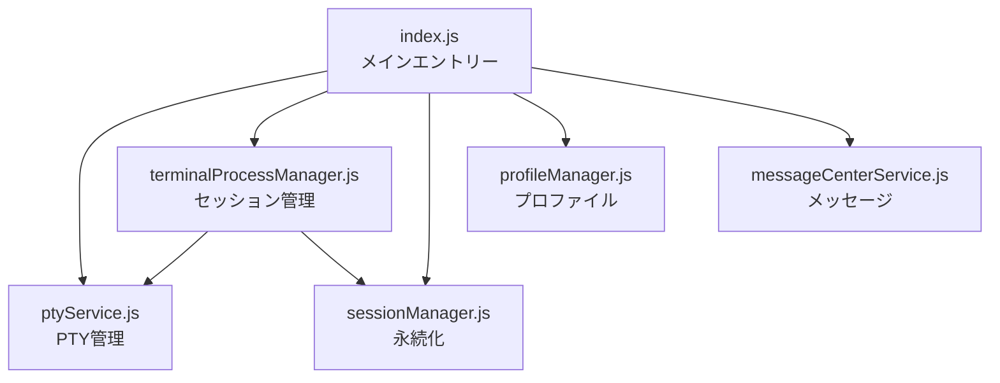
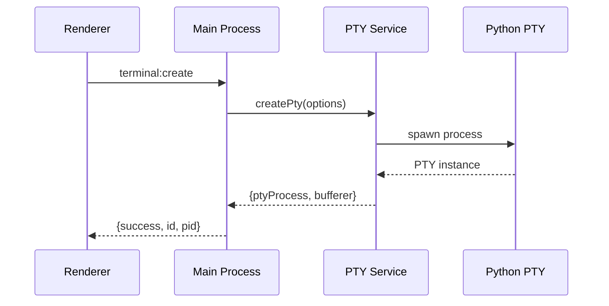
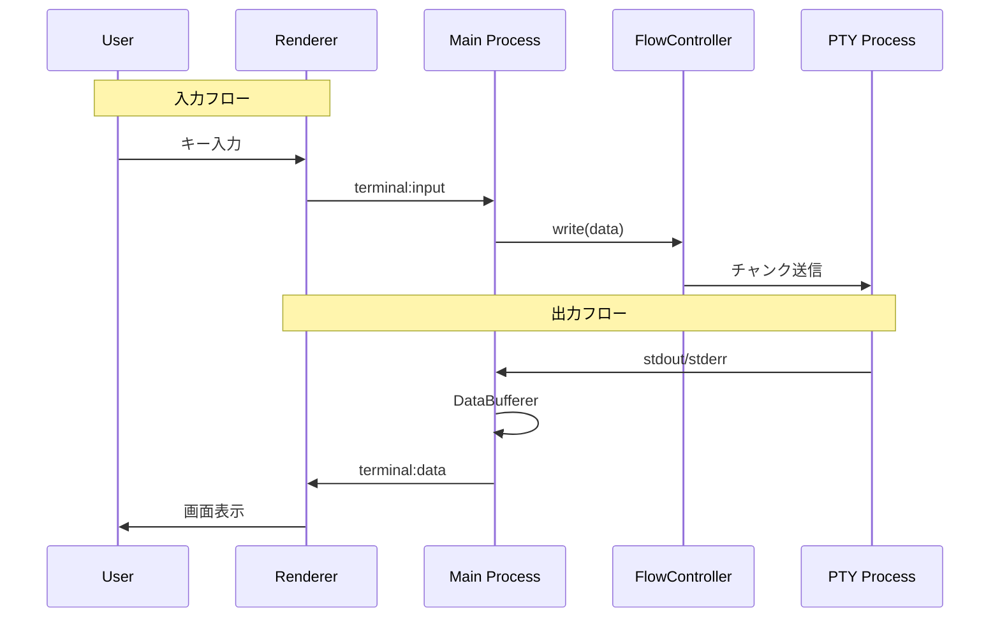

# メインプロセス設計

> 🤖 **Claude Code最適化ドキュメント**  
> Electronメインプロセスの完全ガイド。バックエンド処理の中枢を理解する。

## 🎯 クイックナビゲーション

| やりたいこと | 参照セクション | 主要ファイル |
|------------|--------------|------------|
| 新しいサービスを追加 | [サービス統合](#サービス統合) | `src/main/index.js:45-89` |
| IPCハンドラーを追加 | [IPCハンドラー実装](#ipcハンドラー実装) | `src/main/index.js:155-610` |
| PTY処理を修正 | [PTYサービス](#ptyservice) | `src/main/ptyService.js` |
| ウィンドウ管理を変更 | [ウィンドウ管理](#ウィンドウ管理) | `src/main/index.js:91-153` |

## 📋 メインプロセスの責務

```yaml
役割: Electronアプリケーションのバックエンド
主要責務:
  - アプリケーションライフサイクル管理
  - ウィンドウの作成と管理
  - PTY（疑似ターミナル）プロセス管理
  - ファイルシステムアクセス
  - ネイティブOS機能へのアクセス
  - IPCメッセージのルーティング
```

## 🏗️ アーキテクチャ構造

### モジュール構成

```
src/main/
├── index.js                 # エントリーポイント・統合管理
├── ptyService.js           # PTYプロセス管理
├── terminalProcessManager.js # ターミナルセッション管理
├── sessionManager.js       # セッション永続化
├── profileManager.js       # プロファイル管理
├── messageCenterService.js # メッセージセンター
├── monitorService.js       # モニターウィンドウ
├── menuBuilder.js          # メニューバー構築
├── autoUpdater.js          # 自動アップデート
└── zeamiInstance.js        # 個別セッション実装
```

### サービス相関図



## 🔧 コアモジュール詳細

### index.js（メインエントリー）

```javascript
// 📍 src/main/index.js

// 1. アプリケーション初期化（45-89行）
app.whenReady().then(async () => {
    // サービスの初期化順序が重要
    await initializeServices();
    createMainWindow();
    setupIpcHandlers();
    setupAutoUpdater();
});

// 2. ウィンドウ管理（91-153行）
function createMainWindow() {
    mainWindow = new BrowserWindow({
        width: 1200,
        height: 800,
        webPreferences: {
            preload: path.join(__dirname, '../preload/index.js'),
            contextIsolation: true,    // ⚠️ セキュリティ必須
            nodeIntegration: false,    // ⚠️ セキュリティ必須
            sandbox: true              // ⚠️ セキュリティ必須
        }
    });
}

// 3. IPCハンドラー設定（155-610行）
function setupIpcHandlers() {
    // ターミナル管理
    ipcMain.handle('terminal:create', handleTerminalCreate);
    ipcMain.handle('terminal:input', handleTerminalInput);
    // ... 他多数
}
```

### ptyService.js

```javascript
// 📍 src/main/ptyService.js

class PtyService {
    constructor() {
        this.ptyProcesses = new Map();  // terminalId → PTYプロセス
        this.dataBufferers = new Map(); // terminalId → DataBufferer
        this.flowControllers = new Map(); // terminalId → FlowController
    }
    
    // ⚠️ 重要: Python経由のPTY実装
    async createPty(options) {
        const ptyProcess = new WorkingPty(
            options.shell || defaultShell,
            options.args || [],
            {
                cwd: options.cwd,
                env: this._prepareEnv(options.env),
                cols: options.cols || 80,
                rows: options.rows || 24
            }
        );
        
        // データフロー設定
        const bufferer = new DataBufferer();
        const controller = new FlowController(ptyProcess);
        
        return { ptyProcess, bufferer, controller };
    }
}

// 📍 DataBufferer: 出力データのバッファリング（234-289行）
class DataBufferer {
    constructor() {
        this.buffer = Buffer.alloc(0);
        this.maxBufferSize = 64 * 1024; // 64KB
    }
    
    append(data) {
        // バッファオーバーフロー防止
        if (this.buffer.length + data.length > this.maxBufferSize) {
            this.flush();
        }
        this.buffer = Buffer.concat([this.buffer, data]);
    }
}

// 📍 FlowController: 入力フロー制御（345-412行）
class FlowController {
    async write(data, isPasting = false) {
        if (isPasting && data.length > 1000) {
            // ペースト時の特別処理
            await this._writeInChunks(data);
        } else {
            await this.ptyProcess.write(data);
        }
    }
}
```

### サービス統合

```javascript
// 📍 src/main/index.js:45-89

async function initializeServices() {
    // 1. 基盤サービス
    ptyService = new PtyService();
    sessionManager = new SessionManager(app.getPath('userData'));
    
    // 2. ターミナル管理
    terminalProcessManager = new TerminalProcessManager(
        ptyService,
        sessionManager
    );
    
    // 3. UI関連サービス
    profileManager = new ProfileManager(app.getPath('userData'));
    messageCenterService = new MessageCenterService();
    
    // 4. オプショナルサービス
    if (process.env.MONITOR_ENABLED) {
        monitorService = new MonitorService();
    }
}
```

## 📊 データフロー

### ターミナル作成フロー



### データ入出力フロー



## 🚨 クリティカルな実装詳細

### 1. Python PTY実装の理由

```javascript
// 📍 src/main/ptyService.js:89-156
// node-ptyの制限を回避するためPython実装を使用
// 特にWindows環境でのリサイズ、macOSでの権限問題を解決

const ptyProcess = new WorkingPty(shell, args, {
    // Pythonスクリプトがsubprocessでシェルを起動
    // 真のPTY環境を提供
});
```

### 2. 環境変数の準備

```javascript
// 📍 src/main/ptyService.js:456-489
_prepareEnv(customEnv) {
    const env = {
        ...process.env,
        ...customEnv,
        TERM: 'xterm-256color',
        COLORTERM: 'truecolor',
        // 開発ツールのPATH追加
        PATH: this._enhancePath(process.env.PATH)
    };
    
    // Claude Code検出用
    env.ZEAMI_TERM = 'true';
    env.ZEAMI_VERSION = app.getVersion();
    
    return env;
}
```

### 3. ウィンドウ間通信

```javascript
// 📍 src/main/index.js:524-560
// メッセージセンターを介した通信
ipcMain.handle('messageCenter:sendToTerminal', async (event, data) => {
    const { targetWindowId, targetTerminalId, message } = data;
    
    // 対象ウィンドウを検索
    const targetWindow = BrowserWindow.fromId(targetWindowId);
    if (targetWindow) {
        targetWindow.webContents.send('terminal:incomingMessage', {
            terminalId: targetTerminalId,
            message
        });
    }
});
```

## ⚠️ 注意事項

### メモリリーク防止

```javascript
// ❌ 悪い例
ptyProcess.on('data', (data) => {
    // リスナーが蓄積される
});

// ✅ 良い例
// 📍 src/main/terminalProcessManager.js:234
cleanupTerminal(terminalId) {
    const instance = this.terminals.get(terminalId);
    if (instance) {
        instance.removeAllListeners();
        instance.destroy();
        this.terminals.delete(terminalId);
    }
}
```

### エラーハンドリング

```javascript
// 📍 全IPCハンドラーで必須パターン
ipcMain.handle('some:action', async (event, args) => {
    try {
        // バリデーション
        if (!args || !args.requiredField) {
            throw new Error('Invalid arguments');
        }
        
        // 処理実行
        const result = await doSomething(args);
        
        return { success: true, data: result };
    } catch (error) {
        console.error('Error in some:action:', error);
        return { 
            success: false, 
            error: error.message,
            stack: process.env.NODE_ENV === 'development' ? error.stack : undefined
        };
    }
});
```

### プロセス管理

```javascript
// 📍 アプリケーション終了時のクリーンアップ
app.on('before-quit', async () => {
    // すべてのPTYプロセスを確実に終了
    for (const [id, instance] of terminalProcessManager.terminals) {
        await instance.destroy();
    }
});
```

## 🔍 デバッグとトラブルシューティング

### ログ出力

```javascript
// 📍 electron-logを使用
const log = require('electron-log');

// ログレベル設定
log.transports.file.level = 'debug';
log.transports.console.level = 'debug';

// 構造化ログ
log.info('Terminal created', {
    terminalId,
    pid: ptyProcess.pid,
    shell: options.shell
});
```

### 一般的な問題

| 問題 | 原因 | 解決方法 |
|-----|------|---------|
| PTYプロセスが起動しない | Pythonが見つからない | `which python3`で確認 |
| データが文字化けする | エンコーディング不一致 | UTF-8を強制 |
| プロセスがゾンビ化 | 不適切な終了処理 | `destroy()`を確実に呼ぶ |
| メモリ使用量が増加 | リスナーリーク | `removeAllListeners()` |

## 🔗 関連ファイル

- PTY実装: `src/main/ptyService.js`
- セッション管理: `src/main/terminalProcessManager.js`
- IPC定義: `src/common/ipcChannels.js`
- Python PTY: `src/main/pty/working_pty.py`

---

> 💡 **Claude Codeへのヒント**: メインプロセスの変更は慎重に。特にPTY関連はOSごとに動作が異なるため、全プラットフォームでテストが必要です。新しいサービスを追加する場合は、初期化順序とクリーンアップ処理を忘れずに。