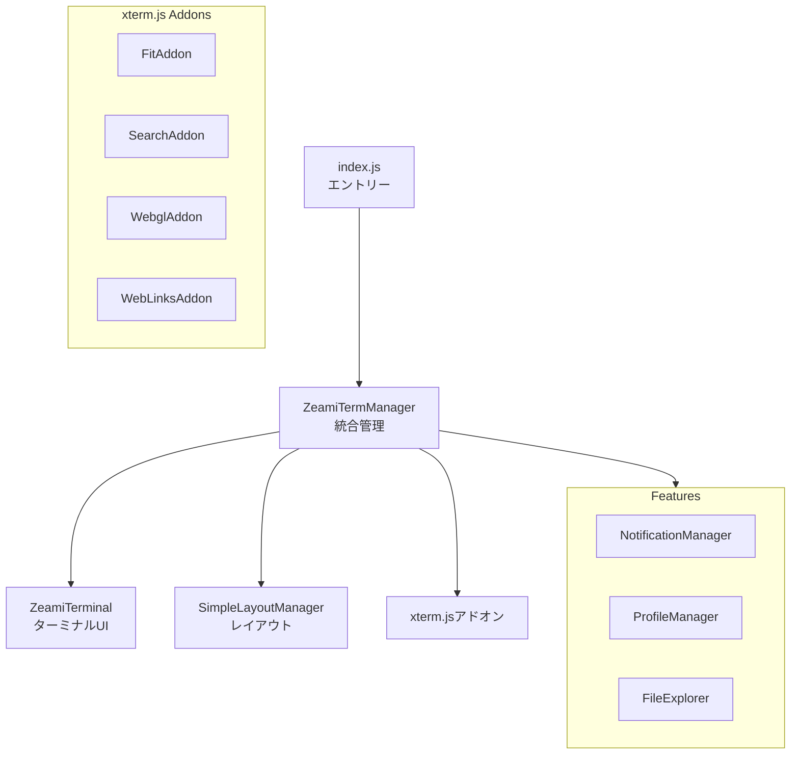

# レンダラープロセス設計

> 🤖 **Claude Code最適化ドキュメント**  
> ZeamiTermのUI層を完全理解。フロントエンド開発の必須ガイド。

## 🎯 クイックナビゲーション

| やりたいこと | 参照セクション | 主要ファイル |
|------------|--------------|------------|
| 新機能のUIを追加 | [UIコンポーネント](#uiコンポーネント) | `src/renderer/components/` |
| ターミナル表示をカスタマイズ | [ZeamiTerminal](#zeamiterminal) | `src/renderer/core/ZeamiTerminal.js` |
| レイアウトを変更 | [レイアウト管理](#レイアウト管理) | `src/renderer/core/SimpleLayoutManager.js` |
| 新しいアドオンを追加 | [xterm.jsアドオン](#xtermjsアドオン) | `src/renderer/core/ZeamiTermManager.js:234-345` |

## 📋 レンダラープロセスの責務

```yaml
役割: ユーザーインターフェースとインタラクション管理
主要責務:
  - ターミナルUIの表示（xterm.js）
  - ユーザー入力の処理
  - レイアウト管理（タブ/分割ビュー）
  - 通知とフィードバック
  - セッション状態の管理
  - コマンドシステム
```

## 🏗️ アーキテクチャ構造

### ディレクトリ構成

```
src/renderer/
├── index.js                    # エントリーポイント
├── index.html                  # HTMLテンプレート
├── styles.css                  # グローバルスタイル
├── core/                       # コア機能
│   ├── ZeamiTermManager.js    # 統合管理
│   ├── ZeamiTerminal.js       # xterm.js拡張
│   ├── SimpleLayoutManager.js  # レイアウト
│   └── pasteHandler.js        # ペースト処理
├── components/                 # UIコンポーネント
│   ├── Toolbar.js             # ツールバー
│   ├── StatusBar.js           # ステータスバー
│   └── TabBar.js              # タブバー
├── features/                   # 機能モジュール
│   ├── NotificationManager.js # 通知
│   ├── ProfileManager.js      # プロファイル
│   └── FileExplorer.js        # ファイル探索
└── commands/                   # コマンドシステム
    ├── CommandRegistry.js      # レジストリ
    ├── help.js                # helpコマンド
    └── save.js                # saveコマンド
```

### コンポーネント相関図



## 🔧 コアモジュール詳細

### ZeamiTermManager（統合管理）

```javascript
// 📍 src/renderer/core/ZeamiTermManager.js

class ZeamiTermManager {
    constructor() {
        // ⚠️ 重要: 固定2ターミナル構成
        this.terminals = new Map([
            ['terminal-a', null],
            ['terminal-b', null]
        ]);
        
        this.layoutManager = new SimpleLayoutManager();
        this.notificationManager = new NotificationManager();
        this.commandRegistry = new CommandRegistry();
        
        this._initializeTerminals();
        this._setupEventListeners();
    }
    
    // 📍 ターミナル作成（123-234行）
    async createTerminal(id = null) {
        // Terminal A/Bは特別扱い
        if (!id && !this.terminals.get('terminal-a')) {
            id = 'terminal-a';
        } else if (!id && !this.terminals.get('terminal-b')) {
            id = 'terminal-b';
        }
        
        const terminal = new ZeamiTerminal({
            // xterm.js設定
            fontSize: 14,
            fontFamily: 'Menlo, Monaco, "Courier New", monospace',
            theme: this._getTheme(),
            cursorBlink: true,
            macOptionIsMeta: true
        });
        
        // アドオン設定
        this._loadAddons(terminal);
        
        // ペースト処理設定（⚠️ Claude Code対応）
        this._configurePasteHandling(terminal);
        
        return terminal;
    }
}
```

### ZeamiTerminal（xterm.js拡張）

```javascript
// 📍 src/renderer/core/ZeamiTerminal.js

class ZeamiTerminal extends Terminal {
    constructor(options) {
        super(options);
        
        this._inPasteMode = false;
        this._pasteBuffer = '';
        this._commandInterceptor = null;
        
        // データハンドリングをオーバーライド
        this._setupDataHandler();
    }
    
    // 📍 ペーストマーカー処理（234-267行）
    _handleData(data) {
        // ⚠️ 重要: 括弧付きペーストモードの手動制御
        if (data.includes('\x1b[200~')) {
            this._inPasteMode = true;
            this._pasteStartTime = Date.now();
            data = data.replace(/\x1b\[200~/g, '');
        }
        
        if (data.includes('\x1b[201~')) {
            this._inPasteMode = false;
            data = data.replace(/\x1b\[201~/g, '');
            this._processPasteBuffer();
        }
        
        // コマンドインターセプト
        if (this._commandInterceptor) {
            const result = this._commandInterceptor(data);
            if (result.handled) return;
        }
        
        // 通常処理
        super.write(data);
    }
}
```

### レイアウト管理

```javascript
// 📍 src/renderer/core/SimpleLayoutManager.js

class SimpleLayoutManager {
    constructor() {
        this.currentLayout = 'tab'; // 'tab' | 'split'
        this.splitPosition = 50; // パーセント
        this.activeTerminal = 'terminal-a';
        
        this._setupDOM();
        this._loadState();
    }
    
    // 📍 レイアウト切り替え（156-189行）
    toggleLayout() {
        this.currentLayout = this.currentLayout === 'tab' ? 'split' : 'tab';
        this._applyLayout();
        this._saveState();
        
        // リサイズイベント発火
        this._notifyTerminalsOfResize();
    }
    
    // 📍 分割位置の調整（234-267行）
    _handleSplitterDrag(event) {
        const container = document.getElementById('terminal-container');
        const rect = container.getBoundingClientRect();
        
        // 垂直分割の場合
        const newPosition = ((event.clientX - rect.left) / rect.width) * 100;
        this.splitPosition = Math.max(20, Math.min(80, newPosition));
        
        this._updateSplitLayout();
    }
}
```

## 📊 UIコンポーネント

### ツールバー

```javascript
// 📍 src/renderer/components/Toolbar.js

class Toolbar {
    constructor(termManager) {
        this.termManager = termManager;
        this.element = this._createElement();
    }
    
    _createElement() {
        const toolbar = document.createElement('div');
        toolbar.className = 'toolbar';
        
        // ボタン作成
        const buttons = [
            { id: 'new-terminal', icon: '➕', title: '新規ターミナル' },
            { id: 'toggle-layout', icon: '⊞', title: 'レイアウト切替' },
            { id: 'clear-terminal', icon: '🗑', title: 'クリア' }
        ];
        
        buttons.forEach(btn => {
            const button = document.createElement('button');
            button.innerHTML = btn.icon;
            button.title = btn.title;
            button.onclick = () => this._handleAction(btn.id);
            toolbar.appendChild(button);
        });
        
        return toolbar;
    }
}
```

### 通知システム

```javascript
// 📍 src/renderer/features/NotificationManager.js

class NotificationManager {
    constructor() {
        this.commandTracking = new Map(); // commandId → 開始時刻
    }
    
    // 📍 コマンド完了通知（89-123行）
    async notifyCommandComplete(commandId, exitCode, commandLine) {
        const startTime = this.commandTracking.get(commandId);
        if (!startTime) return;
        
        const duration = Date.now() - startTime;
        
        // 長時間実行コマンドのみ通知
        if (duration > 5000) { // 5秒以上
            const isSuccess = exitCode === 0;
            
            await window.electronAPI.showNotification({
                title: isSuccess ? 'コマンド完了' : 'コマンド失敗',
                body: `${commandLine} (${this._formatDuration(duration)})`,
                options: {
                    sound: isSuccess ? 'Glass' : 'Basso',
                    urgency: isSuccess ? 'normal' : 'critical'
                }
            });
        }
        
        this.commandTracking.delete(commandId);
    }
}
```

## 🎨 xterm.jsアドオン

### 標準アドオン設定

```javascript
// 📍 src/renderer/core/ZeamiTermManager.js:234-345

_loadAddons(terminal) {
    // 1. FitAddon - 自動サイズ調整
    const fitAddon = new FitAddon();
    terminal.loadAddon(fitAddon);
    
    // 2. SearchAddon - 検索機能
    const searchAddon = new SearchAddon();
    terminal.loadAddon(searchAddon);
    
    // 3. WebLinksAddon - URLリンク化
    const webLinksAddon = new WebLinksAddon();
    terminal.loadAddon(webLinksAddon);
    
    // 4. WebglAddon - GPU高速レンダリング
    try {
        const webglAddon = new WebglAddon();
        terminal.loadAddon(webglAddon);
    } catch (e) {
        // WebGLが使えない場合はCanvasAddonにフォールバック
        const canvasAddon = new CanvasAddon();
        terminal.loadAddon(canvasAddon);
    }
    
    // 5. カスタムアドオン
    const enhancedLinkProvider = new EnhancedLinkProvider();
    terminal.registerLinkProvider(enhancedLinkProvider);
}
```

### カスタムアドオン例

```javascript
// 📍 src/renderer/addons/EnhancedLinkProvider.js

class EnhancedLinkProvider {
    provideLinks(bufferLineNumber, callback) {
        const line = this._terminal.buffer.active.getLine(bufferLineNumber);
        if (!line) return;
        
        const text = line.translateToString();
        const links = [];
        
        // ファイルパス検出（例: src/main/index.js:123）
        const fileRegex = /([.\w\-\/]+\.(js|ts|jsx|tsx|json|md)):(\d+)/g;
        let match;
        
        while ((match = fileRegex.exec(text)) !== null) {
            links.push({
                range: {
                    start: { x: match.index + 1, y: bufferLineNumber + 1 },
                    end: { x: match.index + match[0].length + 1, y: bufferLineNumber + 1 }
                },
                text: match[0],
                activate: () => {
                    // VSCodeで開く
                    window.electronAPI.openInEditor(match[1], parseInt(match[3]));
                }
            });
        }
        
        callback(links);
    }
}
```

## ⚡ パフォーマンス最適化

### レンダリング最適化

```javascript
// 📍 src/renderer/core/ZeamiTermManager.js:456-489

// 1. デバウンスされたリサイズ
let resizeTimeout;
window.addEventListener('resize', () => {
    clearTimeout(resizeTimeout);
    resizeTimeout = setTimeout(() => {
        this.terminals.forEach(terminal => {
            if (terminal && terminal.fitAddon) {
                terminal.fitAddon.fit();
            }
        });
    }, 150); // 150msデバウンス
});

// 2. スマートスクロール
terminal.attachCustomKeyEventHandler((event) => {
    if (event.shiftKey && event.type === 'wheel') {
        // Shift+Scrollで10倍速スクロール
        terminal.scrollLines(event.deltaY > 0 ? 10 : -10);
        return false;
    }
    return true;
});
```

### メモリ管理

```javascript
// 📍 ターミナル破棄時のクリーンアップ
destroyTerminal(terminalId) {
    const terminal = this.terminals.get(terminalId);
    if (!terminal) return;
    
    // アドオンの破棄
    terminal.dispose();
    
    // DOM要素の削除
    const element = document.getElementById(`terminal-${terminalId}`);
    if (element) element.remove();
    
    // リスナーの解除
    window.electronAPI.removeAllListeners(`terminal:data:${terminalId}`);
    
    // マップから削除
    this.terminals.delete(terminalId);
}
```

## 🐛 デバッグツール

### ターミナルデータモニター

```javascript
// 📍 開発モードでのデータ監視
if (process.env.NODE_ENV === 'development') {
    terminal.onData(data => {
        console.log('[Terminal Input]', {
            data: data,
            hex: data.split('').map(c => c.charCodeAt(0).toString(16)),
            isPasting: terminal._inPasteMode
        });
    });
}
```

### パフォーマンスプロファイリング

```javascript
// FPS監視
let lastTime = performance.now();
let frames = 0;

const measureFPS = () => {
    frames++;
    const currentTime = performance.now();
    
    if (currentTime >= lastTime + 1000) {
        console.log(`FPS: ${frames}`);
        frames = 0;
        lastTime = currentTime;
    }
    
    requestAnimationFrame(measureFPS);
};

// 開発時のみ有効化
if (process.env.DEBUG_PERFORMANCE) {
    measureFPS();
}
```

## 🔗 関連コード

- メイン統合: `src/renderer/core/ZeamiTermManager.js`
- ターミナル拡張: `src/renderer/core/ZeamiTerminal.js`
- レイアウト: `src/renderer/core/SimpleLayoutManager.js`
- スタイル: `src/renderer/styles.css`

---

> 💡 **Claude Codeへのヒント**: レンダラープロセスの変更は、必ずDevToolsを開いて確認してください。特にメモリリークとパフォーマンスに注意。新機能追加時は、既存のコンポーネント構造に従ってください。