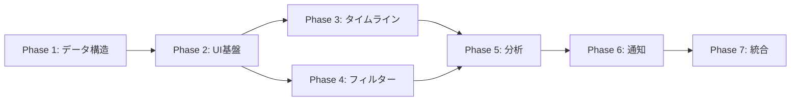

# 📋 Zeamiブリーフケース: Command Intelligence Hub 実装計画

> 🤖 **Claude Code用実装ガイド**  
> このドキュメントは、Message CenterをCommand Intelligence Hubへ進化させるための段階的実装計画です。
> 各フェーズは独立して実装・テスト可能な単位で構成されています。

## 📍 現在地点の確認

### 実装済み機能
- ✅ 基本的なOSCシーケンス対応（ShellIntegrationAddon）
- ✅ シェル統合スクリプト（bash/zsh）
- ✅ 環境変数ZEAMI_TERMの設定
- ✅ Message Centerの基本UI
- ✅ 簡単な通知機能

### 未実装機能
- ❌ 拡張OSCシーケンスの処理
- ❌ コマンド実行の詳細追跡
- ❌ 高度なフィルタリング
- ❌ 統計・分析機能
- ❌ マルチウィンドウ対応

## 🎯 実装フェーズ

### Phase 1: データ構造とバックエンド強化（推定: 2-3時間）

#### 1.1 拡張データモデルの実装
```javascript
// 📍 src/main/models/CommandExecutionModel.js (新規作成)
class CommandExecutionModel {
  constructor() {
    this.schema = {
      // 実装詳細は仕様書参照
    };
  }
}
```

**作業項目:**
- [ ] CommandExecutionModel.jsの作成
- [ ] データバリデーション機能の実装
- [ ] 既存メッセージ構造からの移行ヘルパー

#### 1.2 ShellIntegrationAddonの拡張
```javascript
// 📍 src/renderer/addons/ShellIntegrationAddon.js (編集)
// 全OSCシーケンスのサポートを追加
```

**作業項目:**
- [ ] OSC 0,1,2（タイトル）の実装
- [ ] OSC 52（クリップボード）の実装
- [ ] OSC 1337（iTerm2拡張）の実装
- [ ] データ収集メソッドの強化

#### 1.3 MessageCenterServiceの拡張
```javascript
// 📍 src/main/services/MessageCenterService.js (編集)
// コマンド実行専用のメソッド追加
```

**作業項目:**
- [ ] registerCommandExecution()メソッド追加
- [ ] コマンド履歴の永続化（SQLite or JSON）
- [ ] 統計情報の自動計算

### Phase 2: UI基盤の構築（推定: 3-4時間）

#### 2.1 新しいUIコンポーネント構造
```
src/renderer/components/CommandIntelligence/
├── CommandIntelligenceHub.js    # メインコンテナ
├── views/
│   ├── TimelineView.js          # タイムライン表示
│   ├── AnalysisView.js          # 分析ビュー
│   └── DetailedLogView.js       # 詳細ログ
├── widgets/
│   ├── CommandFilter.js         # フィルターUI
│   ├── ExecutorBadge.js         # 実行者バッジ
│   └── CommandStats.js          # 統計ウィジェット
└── utils/
    ├── CommandCategorizer.js    # コマンド分類
    └── TimeFormatter.js         # 時刻フォーマット
```

**作業項目:**
- [ ] ディレクトリ構造の作成
- [ ] 基本コンポーネントの実装
- [ ] 既存Message Center UIとの統合

#### 2.2 スタイルシートの作成
```css
/* 📍 src/renderer/styles/command-intelligence.css (新規作成) */
```

**作業項目:**
- [ ] タイムラインビューのスタイル
- [ ] スイムレーンレイアウト
- [ ] レスポンシブデザイン対応

### Phase 3: タイムラインビューの実装（推定: 2-3時間）

#### 3.1 タイムライン描画エンジン
```javascript
// 📍 src/renderer/components/CommandIntelligence/views/TimelineView.js
class TimelineView {
  constructor() {
    this.scale = 'minutes'; // seconds, minutes, hours
    this.swimlanes = new Map();
  }
}
```

**作業項目:**
- [ ] 時間軸の自動スケーリング
- [ ] スイムレーン管理
- [ ] コマンドブロックの配置アルゴリズム
- [ ] インタラクション（ズーム、パン）

#### 3.2 リアルタイム更新
**作業項目:**
- [ ] WebSocket/IPC接続
- [ ] 差分更新の実装
- [ ] アニメーション効果

### Phase 4: フィルタリングと検索（推定: 2時間）

#### 4.1 高度なフィルターエンジン
```javascript
// 📍 src/renderer/components/CommandIntelligence/utils/FilterEngine.js
class FilterEngine {
  applyFilters(commands, filters) {
    // 複雑なフィルタリングロジック
  }
}
```

**作業項目:**
- [ ] フィルターUIコンポーネント
- [ ] クエリパーサー
- [ ] フィルター永続化
- [ ] プリセットフィルター

### Phase 5: 分析機能の実装（推定: 2-3時間）

#### 5.1 統計エンジン
```javascript
// 📍 src/renderer/components/CommandIntelligence/utils/StatsEngine.js
```

**作業項目:**
- [ ] 基本統計（合計、平均、成功率）
- [ ] 時系列分析
- [ ] カテゴリ別集計
- [ ] エラーパターン分析

#### 5.2 グラフ表示
**作業項目:**
- [ ] Chart.jsまたはD3.jsの統合
- [ ] インタラクティブグラフ
- [ ] データエクスポート機能

### Phase 6: 通知とアラート（推定: 1-2時間）

#### 6.1 ルールエンジン
```javascript
// 📍 src/main/services/NotificationRuleEngine.js
```

**作業項目:**
- [ ] ルール定義フォーマット
- [ ] 条件評価エンジン
- [ ] アクション実行
- [ ] ユーザー設定UI

### Phase 7: 最終統合とテスト（推定: 2時間）

**作業項目:**
- [ ] 全機能の統合テスト
- [ ] パフォーマンス最適化
- [ ] メモリリーク確認
- [ ] ドキュメント更新

## 🚀 実装順序の推奨



## 📝 実装時の注意事項

### パフォーマンス考慮
- 大量のコマンド履歴（10,000+）でも高速動作
- 仮想スクロール/ページネーション
- インデックス付きデータストア

### 後方互換性
- 既存のMessage Center機能は維持
- 段階的な機能追加
- 設定による新旧UI切り替え

### テスト戦略
- 各フェーズごとに単体テスト
- E2Eテストシナリオ
- 負荷テスト

## 🔧 開発用コマンド

```bash
# 開発開始
npm run dev

# 新機能のみのテスト
npm run test:command-intelligence

# ビルド検証
npm run build:test
```

## 📊 進捗トラッキング

| Phase | 推定時間 | 実際 | 状態 | 備考 |
|-------|---------|------|------|------|
| 1 | 2-3h | - | 🔄 | - |
| 2 | 3-4h | - | ⏸️ | - |
| 3 | 2-3h | - | ⏸️ | - |
| 4 | 2h | - | ⏸️ | - |
| 5 | 2-3h | - | ⏸️ | - |
| 6 | 1-2h | - | ⏸️ | - |
| 7 | 2h | - | ⏸️ | - |

**合計推定時間:** 14-19時間（Claude Codeによる並列作業で大幅短縮可能）

## 🎯 次のアクション

1. このブリーフケースを確認
2. Phase 1から順次実装開始
3. 各フェーズ完了時に動作確認
4. 必要に応じて計画を調整

---

> 💡 **Claude Codeへ**: このブリーフケースに従って実装を進めてください。各フェーズは独立しているため、並列で作業することも可能です。不明な点があれば質問してください。