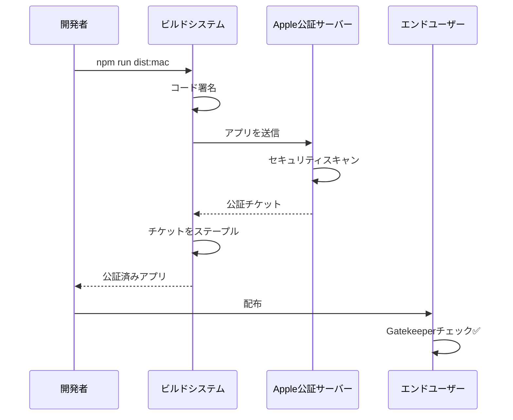

# macOS公証（Notarization）

> 🤖 **Claude Code最適化ドキュメント**  
> macOS Gatekeeperを通過するための公証プロセス完全ガイド。

## 🎯 クイック公証

```bash
# 自動公証（推奨）
npm run notarize:mac

# 手動公証
xcrun notarytool submit dist/mac/ZeamiTerm.app.zip \
  --apple-id YOUR_APPLE_ID \
  --team-id YOUR_TEAM_ID \
  --password YOUR_APP_SPECIFIC_PASSWORD \
  --wait
```

## 📋 公証の概要

```yaml
目的: macOSでの配布時にGatekeeperの警告を回避
要件:
  - Apple Developer ID
  - アプリ固有パスワード
  - macOS 10.14以降で必須
  - 年額$99のDeveloper Program
プロセス:
  1. コード署名
  2. 公証サーバーへ送信
  3. Appleによる自動スキャン
  4. 公証チケットのステープル
```

## 🔧 事前準備

### 1. Apple Developer IDの取得

```bash
# Developer IDの確認
security find-identity -v -p codesigning

# 出力例
1) ABCDEF1234567890 "Developer ID Application: Your Name (TEAM_ID)"
2) 1234567890ABCDEF "Developer ID Installer: Your Name (TEAM_ID)"
```

### 2. アプリ固有パスワードの生成

1. [appleid.apple.com](https://appleid.apple.com)にアクセス
2. セキュリティセクションで「アプリ固有のパスワード」を生成
3. 「ZeamiTerm Notarization」など分かりやすい名前を付ける

### 3. 環境変数の設定

```bash
# ~/.zshrc または ~/.bash_profile に追加
export APPLE_ID="your-apple-id@example.com"
export APPLE_ID_PASSWORD="xxxx-xxxx-xxxx-xxxx"  # アプリ固有パスワード
export APPLE_TEAM_ID="YOUR_TEAM_ID"
```

## 🏗️ 公証プロセス

### 1. Hardened Runtimeの有効化

```javascript
// 📍 forge.config.js
module.exports = {
  packagerConfig: {
    osxSign: {
      identity: 'Developer ID Application: Your Name (TEAM_ID)',
      'hardened-runtime': true,
      entitlements: 'build/entitlements.mac.plist',
      'entitlements-inherit': 'build/entitlements.mac.plist',
      'signature-flags': 'library'
    }
  }
};
```

### 2. エンタイトルメントファイル

```xml
<!-- 📍 build/entitlements.mac.plist -->
<?xml version="1.0" encoding="UTF-8"?>
<!DOCTYPE plist PUBLIC "-//Apple//DTD PLIST 1.0//EN" "http://www.apple.com/DTDs/PropertyList-1.0.dtd">
<plist version="1.0">
<dict>
    <!-- 必須: コード署名の検証を許可 -->
    <key>com.apple.security.cs.allow-jit</key>
    <true/>
    
    <!-- 必須: 未署名の実行可能コードを許可（node-pty用） -->
    <key>com.apple.security.cs.allow-unsigned-executable-memory</key>
    <true/>
    
    <!-- 必須: DYLD環境変数を許可 -->
    <key>com.apple.security.cs.allow-dyld-environment-variables</key>
    <true/>
    
    <!-- オプション: デバッグを許可（開発版のみ） -->
    <key>com.apple.security.cs.debugger</key>
    <true/>
</dict>
</plist>
```

### 3. 自動公証スクリプト

```javascript
// 📍 scripts/notarize.js

const { notarize } = require('@electron/notarize');
const path = require('path');

exports.default = async function notarizing(context) {
  const { electronPlatformName, appOutDir } = context;
  
  if (electronPlatformName !== 'darwin') {
    return;
  }

  const appName = context.packager.appInfo.productFilename;
  const appPath = path.join(appOutDir, `${appName}.app`);

  console.log('🍎 Notarizing application...');
  
  try {
    await notarize({
      tool: 'notarytool',  // 新しいツール（推奨）
      appPath,
      appleId: process.env.APPLE_ID,
      appleIdPassword: process.env.APPLE_ID_PASSWORD,
      teamId: process.env.APPLE_TEAM_ID
    });
    
    console.log('✅ Notarization successful!');
  } catch (error) {
    console.error('❌ Notarization failed:', error);
    throw error;
  }
};
```

### 4. ビルド設定への統合

```javascript
// 📍 forge.config.js
module.exports = {
  hooks: {
    postPackage: require('./scripts/notarize').default
  }
};
```

## 📊 公証ワークフロー

### 完全な公証フロー



## ⚡ 公証の最適化

### 1. 並列公証

```javascript
// 📍 複数アーキテクチャの並列公証

async function notarizeMultipleArchs() {
  const architectures = ['x64', 'arm64'];
  
  const notarizePromises = architectures.map(arch => {
    const appPath = `dist/mac-${arch}/ZeamiTerm.app`;
    
    return notarize({
      tool: 'notarytool',
      appPath,
      appleId: process.env.APPLE_ID,
      appleIdPassword: process.env.APPLE_ID_PASSWORD,
      teamId: process.env.APPLE_TEAM_ID
    });
  });
  
  await Promise.all(notarizePromises);
}
```

### 2. 公証ステータスの確認

```bash
# 公証履歴の確認
xcrun notarytool history \
  --apple-id YOUR_APPLE_ID \
  --team-id YOUR_TEAM_ID \
  --password YOUR_APP_SPECIFIC_PASSWORD

# 特定の公証の詳細
xcrun notarytool info SUBMISSION_ID \
  --apple-id YOUR_APPLE_ID \
  --team-id YOUR_TEAM_ID \
  --password YOUR_APP_SPECIFIC_PASSWORD

# ログの取得
xcrun notarytool log SUBMISSION_ID \
  --apple-id YOUR_APPLE_ID \
  --team-id YOUR_TEAM_ID \
  --password YOUR_APP_SPECIFIC_PASSWORD
```

### 3. ステープル処理

```bash
# 公証チケットのステープル
xcrun stapler staple dist/mac/ZeamiTerm.app

# ステープルの検証
xcrun stapler validate dist/mac/ZeamiTerm.app
```

## 🐛 トラブルシューティング

### よくあるエラーと対処法

| エラー | 原因 | 解決方法 |
|--------|------|---------|
| "The signature is invalid" | 署名が破損 | 再署名してから公証 |
| "Package has no signed executables" | 実行ファイルが未署名 | すべての実行ファイルに署名 |
| "The binary uses an SDK older than..." | 古いSDK | Xcodeを更新 |
| "Hardened Runtime is not enabled" | Hardened Runtime無効 | entitlementsを確認 |

### デバッグ手順

```bash
# 1. 署名の検証
codesign -dv --verbose=4 dist/mac/ZeamiTerm.app

# 2. エンタイトルメントの確認
codesign -d --entitlements - dist/mac/ZeamiTerm.app

# 3. 公証前のローカルテスト
spctl -a -vvv -t install dist/mac/ZeamiTerm.app

# 4. 公証ログの詳細確認
xcrun notarytool log --apple-id YOUR_APPLE_ID [submission-id]
```

## 🔍 公証の検証

### エンドユーザー視点での確認

```bash
# Gatekeeperでの検証
spctl --assess --verbose dist/mac/ZeamiTerm.app

# 期待される出力
dist/mac/ZeamiTerm.app: accepted
source=Notarized Developer ID

# 公証情報の確認
stapler validate -v dist/mac/ZeamiTerm.app
```

### CI/CDでの自動検証

```yaml
# 📍 .github/workflows/notarize.yml

- name: Verify Notarization
  run: |
    # アプリが公証されているか確認
    if ! xcrun stapler validate "dist/mac/ZeamiTerm.app"; then
      echo "❌ Notarization validation failed"
      exit 1
    fi
    
    # Gatekeeperテスト
    if ! spctl -a -vvv -t install "dist/mac/ZeamiTerm.app"; then
      echo "❌ Gatekeeper check failed"
      exit 1
    fi
    
    echo "✅ Notarization verified successfully"
```

## 📝 ベストプラクティス

### 1. セキュアな認証情報管理

```javascript
// ❌ 悪い例：ハードコーディング
const appleId = "user@example.com";

// ✅ 良い例：環境変数
const appleId = process.env.APPLE_ID;

// ✅ さらに良い例：キーチェーン
const { execSync } = require('child_process');
const appleIdPassword = execSync(
  'security find-generic-password -s "ZeamiTerm-Notarization" -w'
).toString().trim();
```

### 2. エラーハンドリング

```javascript
// 📍 リトライ機能付き公証

async function notarizeWithRetry(appPath, maxRetries = 3) {
  for (let i = 0; i < maxRetries; i++) {
    try {
      await notarize({
        tool: 'notarytool',
        appPath,
        appleId: process.env.APPLE_ID,
        appleIdPassword: process.env.APPLE_ID_PASSWORD,
        teamId: process.env.APPLE_TEAM_ID
      });
      
      return true;
    } catch (error) {
      console.error(`Notarization attempt ${i + 1} failed:`, error);
      
      if (i === maxRetries - 1) {
        throw error;
      }
      
      // 待機してリトライ
      await new Promise(resolve => setTimeout(resolve, 30000));
    }
  }
}
```

## 🔗 関連ドキュメント

- [コード署名](./code-signing.md)
- [ビルドガイド](./build-guide.md)
- [リリースプロセス](./release-process.md)

---

> 💡 **Claude Codeへのヒント**: 公証は時間がかかる場合があります（5-30分）。`--wait`オプションを使用すると、完了まで待機します。CI/CDでは必須です。