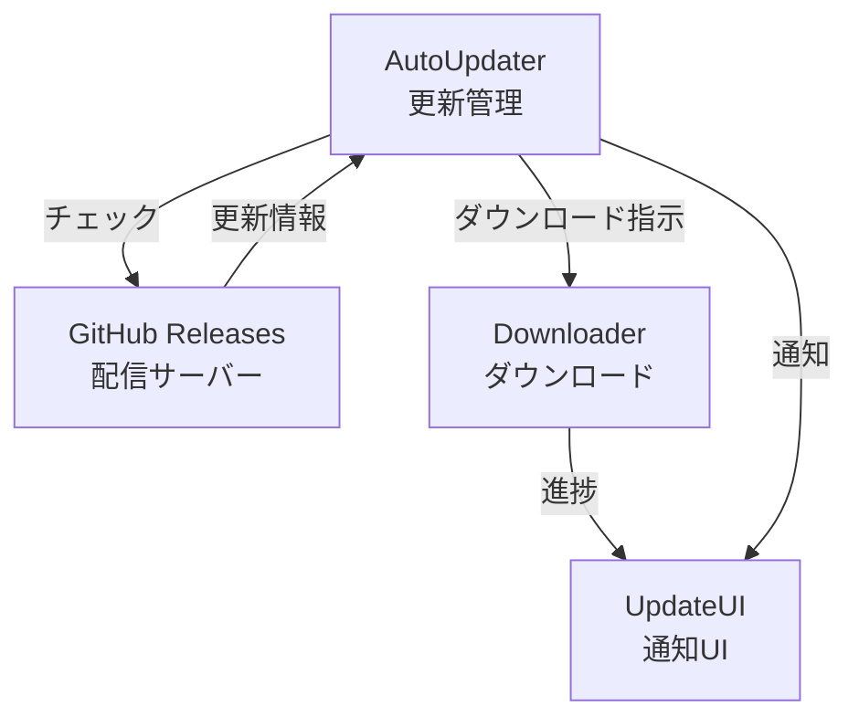

# 自動アップデート

> 🤖 **Claude Code最適化ドキュメント**  
> 常に最新版を維持。シームレスな自動アップデート機能の完全ガイド。

## 🎯 クイックリファレンス

| 機能 | デフォルト設定 | 設定場所 |
|-----|-------------|---------|
| 自動チェック | 起動時 + 4時間ごと | `config.general.autoUpdate` |
| 自動ダウンロード | 有効 | `config.autoUpdate.autoDownload` |
| 自動インストール | 無効（確認必要） | `config.autoUpdate.autoInstall` |
| プレリリース | 無効 | `config.autoUpdate.allowPrerelease` |

## 📋 自動アップデートの概要

```yaml
実装: electron-updater
配信方式: GitHub Releases
対応プラットフォーム:
  - macOS: DMG + ZIP
  - Windows: NSIS + Portable
  - Linux: AppImage + DEB
更新プロセス:
  - バックグラウンドでチェック
  - 差分ダウンロード
  - 署名検証
  - 安全なインストール
```

## 🏗️ アップデートシステム構造

### コンポーネント構成



## 🔧 実装詳細

### AutoUpdaterサービス

```javascript
// 📍 src/main/autoUpdater.js

const { autoUpdater } = require('electron-updater');
const log = require('electron-log');

class AutoUpdaterService {
    constructor() {
        this.updateAvailable = false;
        this.downloadProgress = 0;
        this.updateInfo = null;
        
        this._configure();
        this._setupEventHandlers();
    }
    
    _configure() {
        // 基本設定
        autoUpdater.autoDownload = false; // 手動制御
        autoUpdater.autoInstallOnAppQuit = true;
        autoUpdater.logger = log;
        autoUpdater.logger.transports.file.level = 'info';
        
        // GitHub Releasesの設定
        autoUpdater.setFeedURL({
            provider: 'github',
            owner: 'your-org',
            repo: 'zeami-term',
            private: false // プライベートリポジトリの場合はトークン設定必要
        });
        
        // プレリリースの設定
        autoUpdater.allowPrerelease = process.env.ALLOW_PRERELEASE === 'true';
        autoUpdater.allowDowngrade = false;
    }
    
    _setupEventHandlers() {
        // 更新チェック開始
        autoUpdater.on('checking-for-update', () => {
            log.info('Checking for updates...');
            this._sendStatusToWindow('checking-for-update');
        });
        
        // 更新が利用可能
        autoUpdater.on('update-available', (info) => {
            log.info('Update available:', info);
            this.updateAvailable = true;
            this.updateInfo = info;
            
            this._sendStatusToWindow('update-available', info);
            this._showUpdateDialog(info);
        });
        
        // 更新がない
        autoUpdater.on('update-not-available', (info) => {
            log.info('Update not available:', info);
            this._sendStatusToWindow('update-not-available');
        });
        
        // ダウンロード進捗
        autoUpdater.on('download-progress', (progressObj) => {
            const logMessage = `Download speed: ${progressObj.bytesPerSecond} - Downloaded ${progressObj.percent}% (${progressObj.transferred}/${progressObj.total})`;
            log.info(logMessage);
            
            this.downloadProgress = progressObj.percent;
            this._sendStatusToWindow('download-progress', progressObj);
        });
        
        // ダウンロード完了
        autoUpdater.on('update-downloaded', (info) => {
            log.info('Update downloaded:', info);
            this._sendStatusToWindow('update-downloaded', info);
            this._showInstallDialog(info);
        });
        
        // エラー処理
        autoUpdater.on('error', (err) => {
            log.error('Update error:', err);
            this._sendStatusToWindow('error', err.message);
            
            // エラー通知
            dialog.showErrorBox(
                'アップデートエラー',
                `アップデート中にエラーが発生しました:\n${err.message}`
            );
        });
    }
    
    // 手動チェック
    async checkForUpdates() {
        try {
            const result = await autoUpdater.checkForUpdates();
            return result;
        } catch (error) {
            log.error('Check for updates failed:', error);
            throw error;
        }
    }
    
    // 更新ダイアログ
    async _showUpdateDialog(updateInfo) {
        const { response } = await dialog.showMessageBox({
            type: 'info',
            title: '新しいバージョンが利用可能',
            message: `ZeamiTerm ${updateInfo.version} が利用可能です`,
            detail: this._formatReleaseNotes(updateInfo.releaseNotes),
            buttons: ['ダウンロード', '後で', 'スキップ'],
            defaultId: 0,
            cancelId: 1
        });
        
        switch (response) {
            case 0: // ダウンロード
                this.downloadUpdate();
                break;
            case 2: // スキップ
                this._skipVersion(updateInfo.version);
                break;
        }
    }
    
    // ダウンロード開始
    async downloadUpdate() {
        try {
            await autoUpdater.downloadUpdate();
        } catch (error) {
            log.error('Download failed:', error);
            throw error;
        }
    }
    
    // インストールダイアログ
    async _showInstallDialog(updateInfo) {
        const { response } = await dialog.showMessageBox({
            type: 'info',
            title: 'アップデート準備完了',
            message: `ZeamiTerm ${updateInfo.version} をインストールする準備ができました`,
            detail: '今すぐインストールしますか？アプリケーションは再起動されます。',
            buttons: ['今すぐインストール', '終了時にインストール'],
            defaultId: 0,
            cancelId: 1
        });
        
        if (response === 0) {
            setImmediate(() => {
                app.removeAllListeners('window-all-closed');
                autoUpdater.quitAndInstall();
            });
        }
    }
    
    // リリースノートのフォーマット
    _formatReleaseNotes(releaseNotes) {
        if (typeof releaseNotes === 'string') {
            return releaseNotes;
        }
        
        if (Array.isArray(releaseNotes)) {
            return releaseNotes
                .map(note => `${note.version}:\n${note.note}`)
                .join('\n\n');
        }
        
        return '詳細はGitHubのリリースページをご確認ください。';
    }
}
```

### 更新UIコンポーネント

```javascript
// 📍 src/renderer/features/UpdateNotification.js

class UpdateNotification {
    constructor() {
        this.element = null;
        this.progressBar = null;
        
        this._setupEventListeners();
    }
    
    _setupEventListeners() {
        window.electronAPI.onUpdateStatus((event, data) => {
            switch (event) {
                case 'checking-for-update':
                    this._showChecking();
                    break;
                    
                case 'update-available':
                    this._showUpdateAvailable(data);
                    break;
                    
                case 'update-not-available':
                    this._hide();
                    break;
                    
                case 'download-progress':
                    this._showProgress(data);
                    break;
                    
                case 'update-downloaded':
                    this._showReadyToInstall(data);
                    break;
                    
                case 'error':
                    this._showError(data);
                    break;
            }
        });
    }
    
    _showUpdateAvailable(info) {
        this.element = this._createElement('update-available');
        
        this.element.innerHTML = `
            <div class="update-notification">
                <div class="update-icon">🎉</div>
                <div class="update-content">
                    <h4>新しいバージョンが利用可能</h4>
                    <p>ZeamiTerm ${info.version}</p>
                    <div class="update-actions">
                        <button class="download-btn">ダウンロード</button>
                        <button class="release-notes-btn">リリースノート</button>
                        <button class="dismiss-btn">後で</button>
                    </div>
                </div>
            </div>
        `;
        
        // イベントハンドラー
        this.element.querySelector('.download-btn').onclick = () => {
            window.electronAPI.downloadUpdate();
        };
        
        this.element.querySelector('.release-notes-btn').onclick = () => {
            this._showReleaseNotes(info);
        };
        
        this.element.querySelector('.dismiss-btn').onclick = () => {
            this._hide();
        };
        
        document.body.appendChild(this.element);
    }
    
    _showProgress(progressInfo) {
        if (!this.progressBar) {
            this.element = this._createElement('download-progress');
            
            this.element.innerHTML = `
                <div class="update-notification">
                    <div class="update-icon">⬇️</div>
                    <div class="update-content">
                        <h4>アップデートをダウンロード中...</h4>
                        <div class="progress-bar">
                            <div class="progress-fill" style="width: 0%"></div>
                        </div>
                        <p class="progress-info">
                            <span class="percent">0%</span>
                            <span class="speed">0 KB/s</span>
                        </p>
                    </div>
                </div>
            `;
            
            this.progressBar = this.element.querySelector('.progress-fill');
            document.body.appendChild(this.element);
        }
        
        // 進捗更新
        this.progressBar.style.width = `${progressInfo.percent}%`;
        this.element.querySelector('.percent').textContent = `${Math.round(progressInfo.percent)}%`;
        this.element.querySelector('.speed').textContent = this._formatSpeed(progressInfo.bytesPerSecond);
    }
    
    _showReadyToInstall(info) {
        this.element = this._createElement('ready-to-install');
        
        this.element.innerHTML = `
            <div class="update-notification">
                <div class="update-icon">✅</div>
                <div class="update-content">
                    <h4>アップデート準備完了</h4>
                    <p>ZeamiTerm ${info.version} をインストールする準備ができました</p>
                    <div class="update-actions">
                        <button class="install-now-btn">今すぐ再起動</button>
                        <button class="install-later-btn">後でインストール</button>
                    </div>
                </div>
            </div>
        `;
        
        this.element.querySelector('.install-now-btn').onclick = () => {
            window.electronAPI.installUpdate();
        };
        
        this.element.querySelector('.install-later-btn').onclick = () => {
            this._hide();
            this._showMinimizedNotification();
        };
        
        document.body.appendChild(this.element);
    }
    
    _formatSpeed(bytesPerSecond) {
        if (bytesPerSecond < 1024) {
            return `${bytesPerSecond} B/s`;
        } else if (bytesPerSecond < 1024 * 1024) {
            return `${(bytesPerSecond / 1024).toFixed(1)} KB/s`;
        } else {
            return `${(bytesPerSecond / (1024 * 1024)).toFixed(1)} MB/s`;
        }
    }
}
```

## 🎨 設定とカスタマイズ

### 更新設定

```json
{
  "autoUpdate": {
    "enabled": true,
    "checkOnStartup": true,
    "checkInterval": 14400000,  // 4時間（ミリ秒）
    "autoDownload": true,
    "autoInstall": false,
    "allowPrerelease": false,
    "allowDowngrade": false,
    "channel": "stable"  // stable, beta, alpha
  }
}
```

### 更新チャンネル

```javascript
// 📍 チャンネル別設定

class UpdateChannels {
    static getChannel() {
        const config = this.loadConfig();
        return config.autoUpdate.channel || 'stable';
    }
    
    static setChannel(channel) {
        const validChannels = ['stable', 'beta', 'alpha'];
        
        if (!validChannels.includes(channel)) {
            throw new Error(`Invalid channel: ${channel}`);
        }
        
        // プレリリース設定の自動調整
        autoUpdater.allowPrerelease = channel !== 'stable';
        
        // チャンネル別のフィードURL
        autoUpdater.setFeedURL({
            provider: 'github',
            owner: 'your-org',
            repo: 'zeami-term',
            channel: channel
        });
    }
}
```

## ⚡ 高度な機能

### 差分アップデート

```javascript
// 📍 差分ダウンロードの実装

class DifferentialUpdater {
    static configureDifferentialUpdate() {
        autoUpdater.differentialPackage = true;
        
        // ブロックマップの生成設定
        autoUpdater.blockMapDataUrl = true;
        
        // 差分計算のカスタマイズ
        autoUpdater.on('differential-download-progress', (info) => {
            console.log('Differential download:', {
                total: info.total,
                delta: info.delta,
                percent: ((info.delta / info.total) * 100).toFixed(2)
            });
        });
    }
}
```

### ロールバック機能

```javascript
// 📍 アップデート失敗時のロールバック

class UpdateRollback {
    static async createBackup() {
        const appPath = app.getAppPath();
        const backupPath = path.join(
            app.getPath('userData'),
            'backups',
            `backup-${app.getVersion()}`
        );
        
        await fs.copy(appPath, backupPath);
        
        return backupPath;
    }
    
    static async rollback(backupPath) {
        const appPath = app.getAppPath();
        
        // 現在のバージョンを削除
        await fs.remove(appPath);
        
        // バックアップを復元
        await fs.copy(backupPath, appPath);
        
        // 再起動
        app.relaunch();
        app.exit(0);
    }
}
```

### カスタム更新サーバー

```javascript
// 📍 企業環境向けカスタムサーバー

class CustomUpdateServer {
    static configure(serverUrl) {
        autoUpdater.setFeedURL({
            provider: 'generic',
            url: serverUrl,
            headers: {
                'Authorization': `Bearer ${this.getUpdateToken()}`
            }
        });
        
        // プロキシ設定
        if (process.env.HTTPS_PROXY) {
            autoUpdater.requestHeaders = {
                ...autoUpdater.requestHeaders,
                'Proxy-Authorization': this.getProxyAuth()
            };
        }
    }
}
```

## 🔍 トラブルシューティング

### よくある問題

| 問題 | 原因 | 解決方法 |
|-----|------|---------|
| 更新が検出されない | ネットワーク制限 | プロキシ設定確認 |
| ダウンロードが遅い | 帯域制限 | 差分更新を有効化 |
| インストール失敗 | 権限不足 | 管理者権限で実行 |
| 署名検証エラー | 証明書問題 | 証明書を更新 |

### デバッグログ

```javascript
// 詳細なログを有効化
require('electron-log').transports.file.level = 'debug';
autoUpdater.logger = require('electron-log');

// ログファイルの場所
// macOS: ~/Library/Logs/zeami-term/main.log
// Windows: %USERPROFILE%\AppData\Roaming\zeami-term\logs\main.log
// Linux: ~/.config/zeami-term/logs/main.log
```

## 🔗 関連ドキュメント

- [リリースプロセス](../deployment/release-process.md)
- [コード署名](../deployment/code-signing.md)
- [配布設定](../deployment/distribution.md)

---

> 💡 **Claude Codeへのヒント**: 自動アップデートは慎重にテストしてください。特に、ロールバック機能は本番環境で重要です。開発時は`allowDowngrade: true`で古いバージョンへの切り替えをテストできます。