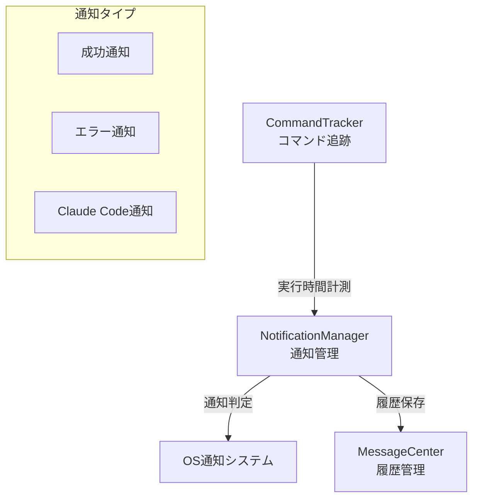

# 通知システム

> 🤖 **Claude Code最適化ドキュメント**  
> 長時間実行コマンドの完了を見逃さない。スマートな通知機能の完全ガイド。

## 🎯 クイックリファレンス

| 機能 | デフォルト設定 | 設定場所 |
|-----|-------------|---------|
| 通知トリガー時間 | 5秒以上 | `config.notifications.minDuration` |
| 通知音（macOS） | Glass | `config.notifications.sound` |
| エラー時の通知音 | Basso | 自動切替 |
| Claude Code検出 | 自動 | ハードコーディング |

## 📋 通知システムの概要

```yaml
目的: 長時間実行コマンドの完了を通知
主な機能:
  - 実行時間ベースの自動通知
  - 成功/失敗の自動判定
  - Claude Code専用の通知
  - メッセージセンター連携
  - プラットフォーム固有の通知
```

## 🏗️ 通知システムアーキテクチャ

### コンポーネント構成



## 🔧 実装詳細

### NotificationManager

```javascript
// 📍 src/renderer/features/NotificationManager.js

class NotificationManager {
    constructor(config) {
        this.config = config;
        this.commandTracking = new Map(); // commandId → {startTime, commandLine}
        this.notificationQueue = [];
        this.claudeCodePatterns = [
            /^claude\s+/,
            /claude\s+code/,
            /claude\s+--/
        ];
    }
    
    // コマンド開始の追跡
    trackCommandStart(commandId, commandLine) {
        this.commandTracking.set(commandId, {
            startTime: Date.now(),
            commandLine: commandLine.trim()
        });
        
        // Claude Code検出
        if (this._isClaudeCommand(commandLine)) {
            this._markAsClaudeSession(commandId);
        }
    }
    
    // コマンド完了の処理
    async trackCommandEnd(commandId, exitCode) {
        const tracking = this.commandTracking.get(commandId);
        if (!tracking) return;
        
        const duration = Date.now() - tracking.startTime;
        
        // 通知条件の判定
        if (this._shouldNotify(duration, tracking.commandLine)) {
            await this._sendNotification({
                commandId,
                commandLine: tracking.commandLine,
                duration,
                exitCode,
                isClaudeCommand: tracking.isClaudeCommand
            });
        }
        
        // メッセージセンターに記録
        await this._recordToMessageCenter({
            commandId,
            commandLine: tracking.commandLine,
            duration,
            exitCode,
            timestamp: Date.now()
        });
        
        this.commandTracking.delete(commandId);
    }
    
    // 通知条件の判定
    _shouldNotify(duration, commandLine) {
        // 最小実行時間チェック
        if (duration < this.config.notifications.minDuration) {
            return false;
        }
        
        // 除外コマンドチェック
        const excludeCommands = this.config.notifications.filters?.excludeCommands || [];
        if (excludeCommands.some(cmd => commandLine.startsWith(cmd))) {
            return false;
        }
        
        // 含むパターンチェック
        const includePatterns = this.config.notifications.filters?.includePatterns || [];
        if (includePatterns.length > 0) {
            return includePatterns.some(pattern => 
                commandLine.includes(pattern)
            );
        }
        
        return true;
    }
    
    // 通知の送信
    async _sendNotification(data) {
        const { commandLine, duration, exitCode, isClaudeCommand } = data;
        
        // 通知内容の構築
        const notification = {
            title: this._getTitle(exitCode, isClaudeCommand),
            body: this._getBody(commandLine, duration),
            options: {
                ...this._getNotificationOptions(exitCode),
                tag: `cmd-${data.commandId}`,
                requireInteraction: false,
                silent: false
            }
        };
        
        // OS通知の送信
        await window.electronAPI.showNotification(notification);
        
        // 通知履歴に追加
        this.notificationQueue.push({
            ...notification,
            timestamp: Date.now(),
            data
        });
    }
    
    // タイトルの生成
    _getTitle(exitCode, isClaudeCommand) {
        if (isClaudeCommand) {
            return exitCode === 0 ? 'Claude Code 完了' : 'Claude Code エラー';
        }
        
        return exitCode === 0 ? 'コマンド完了' : 'コマンドエラー';
    }
    
    // 本文の生成
    _getBody(commandLine, duration) {
        const truncated = commandLine.length > 50 
            ? commandLine.substring(0, 47) + '...' 
            : commandLine;
        
        return `${truncated}\n実行時間: ${this._formatDuration(duration)}`;
    }
    
    // 通知オプションの生成
    _getNotificationOptions(exitCode) {
        const isSuccess = exitCode === 0;
        
        // macOS固有の設定
        if (process.platform === 'darwin') {
            return {
                sound: isSuccess ? 'Glass' : 'Basso',
                urgency: isSuccess ? 'normal' : 'critical'
            };
        }
        
        // Windows/Linux
        return {
            urgency: isSuccess ? 'normal' : 'critical',
            icon: isSuccess ? 'success.png' : 'error.png'
        };
    }
    
    // 実行時間のフォーマット
    _formatDuration(ms) {
        if (ms < 1000) return `${ms}ms`;
        if (ms < 60000) return `${(ms / 1000).toFixed(1)}秒`;
        
        const minutes = Math.floor(ms / 60000);
        const seconds = Math.floor((ms % 60000) / 1000);
        return `${minutes}分${seconds}秒`;
    }
}
```

### CommandTracker（コマンド追跡）

```javascript
// 📍 src/renderer/features/CommandTracker.js

class CommandTracker {
    constructor(notificationManager) {
        this.notificationManager = notificationManager;
        this.activeCommands = new Map();
        
        // OSCシーケンスによる追跡（シェル統合）
        this._setupOscHandlers();
        
        // フォールバック: プロンプト検出
        this._setupPromptDetection();
    }
    
    // OSCシーケンスハンドラー
    _setupOscHandlers() {
        // OSC 133 - シェル統合プロトコル
        this.terminal.parser.registerOscHandler(133, (data) => {
            const [type, ...args] = data.split(';');
            
            switch (type) {
                case 'C': // コマンド開始
                    this._onCommandStart();
                    break;
                case 'D': // コマンド終了
                    this._onCommandEnd(parseInt(args[0] || '0'));
                    break;
            }
            
            return true;
        });
    }
    
    // プロンプト検出によるフォールバック
    _setupPromptDetection() {
        let buffer = '';
        let possibleCommand = '';
        
        this.terminal.onData((data) => {
            // Enter キーの検出
            if (data === '\r' || data === '\n') {
                if (possibleCommand.trim()) {
                    const commandId = crypto.randomUUID();
                    this.activeCommands.set(commandId, {
                        command: possibleCommand.trim(),
                        startTime: Date.now()
                    });
                    
                    this.notificationManager.trackCommandStart(
                        commandId, 
                        possibleCommand
                    );
                }
                
                possibleCommand = '';
                buffer = '';
            } else {
                // コマンドの蓄積
                possibleCommand += data;
                buffer += data;
            }
        });
    }
    
    // プロンプトパターンの検出
    _detectPromptEnd() {
        // 一般的なプロンプトパターン
        const promptPatterns = [
            /\$\s*$/,        // $ プロンプト
            />\s*$/,         // > プロンプト
            /%\s*$/,         // % プロンプト（zsh）
            /\]\$\s*$/,      // ]$ プロンプト
            /\]#\s*$/,       // ]# プロンプト（root）
        ];
        
        // 最後の行を取得
        const lastLine = this.terminal.buffer.active
            .getLine(this.terminal.buffer.active.cursorY)
            ?.translateToString() || '';
        
        return promptPatterns.some(pattern => pattern.test(lastLine));
    }
}
```

## 🎨 通知UI

### 通知プレビュー

```javascript
// 📍 src/renderer/components/NotificationPreview.js

class NotificationPreview {
    static show(notification) {
        const preview = document.createElement('div');
        preview.className = 'notification-preview';
        
        preview.innerHTML = `
            <div class="notification-icon ${notification.isError ? 'error' : 'success'}">
                ${notification.isError ? '❌' : '✅'}
            </div>
            <div class="notification-content">
                <h4>${notification.title}</h4>
                <p>${notification.body}</p>
                <span class="notification-time">
                    ${new Date().toLocaleTimeString()}
                </span>
            </div>
            <button class="notification-close">×</button>
        `;
        
        // アニメーション付きで表示
        preview.style.animation = 'slideIn 0.3s ease-out';
        document.body.appendChild(preview);
        
        // 自動非表示
        setTimeout(() => {
            preview.style.animation = 'slideOut 0.3s ease-in';
            setTimeout(() => preview.remove(), 300);
        }, 5000);
        
        // 手動クローズ
        preview.querySelector('.notification-close').onclick = () => {
            preview.remove();
        };
    }
}
```

### メッセージセンター連携

```javascript
// 📍 src/renderer/features/MessageCenter.js

class MessageCenter {
    constructor() {
        this.messages = [];
        this.maxMessages = 100;
        this.filters = {
            type: 'all',
            timeRange: 'today'
        };
    }
    
    // メッセージの追加
    addMessage(message) {
        this.messages.unshift({
            id: crypto.randomUUID(),
            timestamp: Date.now(),
            ...message
        });
        
        // 最大数を超えたら古いものを削除
        if (this.messages.length > this.maxMessages) {
            this.messages = this.messages.slice(0, this.maxMessages);
        }
        
        this._updateUI();
    }
    
    // UI表示
    render() {
        const filtered = this._filterMessages();
        
        return `
            <div class="message-center">
                <div class="message-center-header">
                    <h3>通知履歴</h3>
                    <div class="message-filters">
                        <select onchange="this.filterByType(event)">
                            <option value="all">すべて</option>
                            <option value="success">成功のみ</option>
                            <option value="error">エラーのみ</option>
                            <option value="claude">Claude Codeのみ</option>
                        </select>
                    </div>
                </div>
                
                <div class="message-list">
                    ${filtered.map(msg => this._renderMessage(msg)).join('')}
                </div>
            </div>
        `;
    }
    
    _renderMessage(message) {
        const icon = message.exitCode === 0 ? '✅' : '❌';
        const time = new Date(message.timestamp).toLocaleTimeString();
        
        return `
            <div class="message-item ${message.type}">
                <span class="message-icon">${icon}</span>
                <div class="message-content">
                    <p class="message-command">${message.commandLine}</p>
                    <div class="message-meta">
                        <span class="message-duration">${message.duration}</span>
                        <span class="message-time">${time}</span>
                    </div>
                </div>
                <button onclick="this.resendNotification('${message.id}')">
                    🔔
                </button>
            </div>
        `;
    }
}
```

## ⚡ 高度な機能

### スマート通知フィルター

```javascript
// 📍 インテリジェントフィルタリング

class SmartNotificationFilter {
    constructor() {
        this.patterns = {
            // ビルドコマンド
            build: /^(npm|yarn|pnpm)\s+(run\s+)?build/,
            
            // テストコマンド
            test: /^(npm|yarn|pnpm)\s+(run\s+)?test/,
            
            // デプロイコマンド
            deploy: /deploy|publish|release/i,
            
            // 長時間実行される可能性が高いコマンド
            longRunning: /install|update|upgrade|download|compile|webpack/i
        };
    }
    
    // 優先度の判定
    getPriority(commandLine) {
        if (this.patterns.deploy.test(commandLine)) return 'high';
        if (this.patterns.build.test(commandLine)) return 'medium';
        if (this.patterns.test.test(commandLine)) return 'medium';
        if (this.patterns.longRunning.test(commandLine)) return 'low';
        
        return 'normal';
    }
    
    // 通知設定の調整
    adjustNotificationSettings(commandLine, baseSettings) {
        const priority = this.getPriority(commandLine);
        
        switch (priority) {
            case 'high':
                return {
                    ...baseSettings,
                    requireInteraction: true,
                    urgency: 'critical'
                };
            
            case 'medium':
                return {
                    ...baseSettings,
                    sound: 'Glass'
                };
            
            case 'low':
                return {
                    ...baseSettings,
                    silent: true
                };
            
            default:
                return baseSettings;
        }
    }
}
```

### グループ通知

```javascript
// 📍 関連コマンドのグループ化

class NotificationGrouper {
    constructor() {
        this.groups = new Map();
        this.groupTimeout = 5000; // 5秒
    }
    
    // グループ化の判定
    shouldGroup(notification) {
        // 同じプロジェクトのビルド/テスト
        const projectPattern = /^(npm|yarn)\s+run\s+(\w+)/;
        const match = notification.commandLine.match(projectPattern);
        
        if (match) {
            const key = `project-${match[2]}`;
            return this._addToGroup(key, notification);
        }
        
        return false;
    }
    
    // グループ通知の生成
    createGroupNotification(groupKey) {
        const group = this.groups.get(groupKey);
        if (!group || group.length < 2) return null;
        
        const successCount = group.filter(n => n.exitCode === 0).length;
        const totalCount = group.length;
        
        return {
            title: 'タスクグループ完了',
            body: `${totalCount}個のタスク完了 (成功: ${successCount})`,
            options: {
                sound: successCount === totalCount ? 'Glass' : 'Basso',
                tag: `group-${groupKey}`
            }
        };
    }
}
```

## 🔍 デバッグとカスタマイズ

### 通知のテスト

```javascript
// 開発コンソールでテスト
const testNotification = async () => {
    const nm = window.termManager.notificationManager;
    
    // 成功通知のテスト
    nm.trackCommandStart('test-1', 'npm run build');
    setTimeout(() => {
        nm.trackCommandEnd('test-1', 0);
    }, 6000);
    
    // エラー通知のテスト
    nm.trackCommandStart('test-2', 'npm test');
    setTimeout(() => {
        nm.trackCommandEnd('test-2', 1);
    }, 7000);
};
```

### カスタム通知音

```javascript
// カスタムサウンドの追加
class CustomNotificationSounds {
    static register() {
        // macOS
        const sounds = {
            success: ['Glass', 'Hero', 'Pop'],
            error: ['Basso', 'Funk', 'Blow'],
            custom: ['Ping', 'Tink', 'Morse']
        };
        
        // カスタムサウンドファイル
        if (process.platform === 'darwin') {
            // ~/Library/Sounds/ に配置
        } else if (process.platform === 'win32') {
            // Windows サウンドスキーム
        }
    }
}
```

## 🔗 関連ドキュメント

- [コマンドシステム](../api/commands.md)
- [シェル統合](./shell-integration.md)
- [メッセージセンター](../architecture/main-process.md#メッセージセンター)

---

> 💡 **Claude Codeへのヒント**: 通知システムは、ユーザーの作業を妨げないよう慎重に設計されています。デフォルト設定は控えめですが、重要なコマンド（デプロイなど）は確実に通知されます。