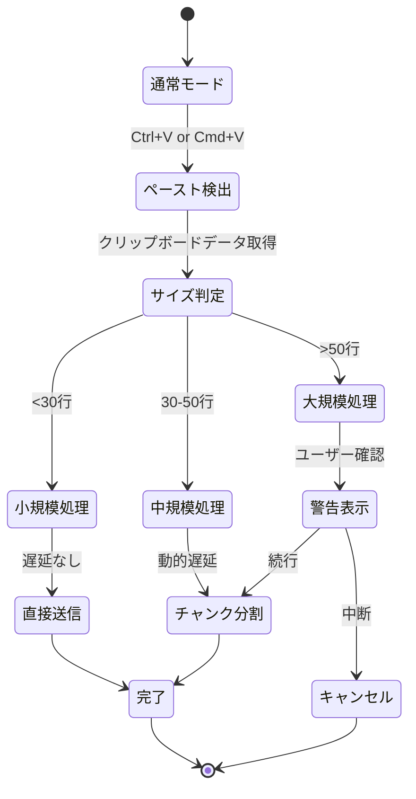

# ペースト処理の詳細実装

> 🤖 **Claude Code最適化ドキュメント**  
> ZeamiTermの最も複雑な機能の一つ、Claude Code対応のペースト処理を完全解説

## 🚨 重要な前提知識

```yaml
特殊要件:
  - Claude Codeは標準的な括弧付きペーストモードに完全対応していない
  - 大量テキストのペースト時にClaude Codeがハングする可能性
  - 30-50行の中規模ペーストで特別な処理が必要
  - ペーストマーカー（\x1b[200~, \x1b[201~）の手動制御が必須
```

## 🎯 クイックリファレンス

| やりたいこと | 参照箇所 | キーファイル |
|------------|---------|------------|
| ペースト遅延を調整 | [動的遅延計算](#動的遅延計算) | `ZeamiTermManager.js:456-478` |
| チャンクサイズを変更 | [チャンク分割ロジック](#チャンク分割ロジック) | `ZeamiTermManager.js:489-512` |
| デバッグモード有効化 | [デバッグ機能](#デバッグ機能) | `PASTE_DEBUG=true` |
| タイムアウト処理修正 | [タイムアウト管理](#タイムアウト管理) | `ZeamiTermManager.js:523-545` |

## 📊 ペースト処理フロー

### 全体の処理フロー



## 🔧 実装詳細

### コア実装ファイル構造

```javascript
// 📍 src/renderer/core/ZeamiTermManager.js
class ZeamiTermManager {
    _configurePasteHandling(terminal) {
        // ペースト処理の設定
    }
    
    _handlePaste(event, terminal) {
        // ペーストイベントのメイン処理
    }
    
    _processPasteData(data, terminal) {
        // データの分割と送信
    }
}

// 📍 src/renderer/core/ZeamiTerminal.js
class ZeamiTerminal extends Terminal {
    _handleData(data) {
        // ペーストマーカーの検出と処理
    }
}
```

### ペーストマーカーの処理

```javascript
// 📍 src/renderer/core/ZeamiTerminal.js:234-267
_handleData(data) {
    // ペースト開始マーカー検出
    if (data.includes('\x1b[200~')) {
        this._inPasteMode = true;
        this._pasteBuffer = '';
        this._pasteStartTime = Date.now();
        
        // ⚠️ 重要: マーカーは削除して処理
        data = data.replace(/\x1b\[200~/g, '');
    }
    
    // ペースト終了マーカー検出
    if (data.includes('\x1b[201~')) {
        this._inPasteMode = false;
        data = data.replace(/\x1b\[201~/g, '');
        
        // バッファされたデータを処理
        this._processPasteBuffer();
    }
}
```

### 動的遅延計算

```javascript
// 📍 src/renderer/core/ZeamiTermManager.js:456-478
_calculateDelay(lineCount) {
    // 行数に基づく動的遅延（ミリ秒）
    if (lineCount < 10) return 10;      // 小規模: 10ms
    if (lineCount < 30) return 50;      // 中規模: 50ms
    if (lineCount < 50) return 100;     // 大規模: 100ms
    return 300;                          // 超大規模: 300ms
}
```

### チャンク分割ロジック

```javascript
// 📍 src/renderer/core/ZeamiTermManager.js:489-512
_splitIntoChunks(data, chunkSize = 30) {
    const lines = data.split('\n');
    const chunks = [];
    
    for (let i = 0; i < lines.length; i += chunkSize) {
        const chunk = lines.slice(i, i + chunkSize).join('\n');
        chunks.push(chunk);
    }
    
    // 最後のチャンクに改行がない場合は追加
    if (!data.endsWith('\n') && chunks.length > 0) {
        chunks[chunks.length - 1] += '\n';
    }
    
    return chunks;
}
```

## 🐛 既知の問題と対策

### 問題1: Claude Codeがペーストをブロック

**症状**: 大量テキストペースト時にClaude Codeが応答しなくなる

**原因**: Claude Codeのバッファが満杯になる

**対策**:
```javascript
// 📍 src/main/ptyService.js:234-256
// FlowControllerで流量制御
class FlowController {
    async write(data) {
        if (this.isPasting && data.length > 1000) {
            // ペースト時は小さなチャンクで送信
            const chunks = this.splitData(data, 500);
            for (const chunk of chunks) {
                await this.writeChunk(chunk);
                await this.delay(50); // 強制遅延
            }
        }
    }
}
```

### 問題2: ペーストマーカーの二重送信

**症状**: ペーストした内容に`^[[200~`が表示される

**原因**: ブラウザとxtermの両方がマーカーを送信

**対策**:
```javascript
// 📍 src/renderer/core/ZeamiTermManager.js:345-367
terminal.attachCustomKeyEventHandler((event) => {
    // ペーストイベントをインターセプト
    if ((event.ctrlKey || event.metaKey) && event.key === 'v') {
        event.preventDefault();
        this._handlePaste(event, terminal);
        return false;
    }
    return true;
});
```

### 問題3: 部分的なペースト

**症状**: ペーストした内容が途中で切れる

**原因**: タイムアウトまたはバッファオーバーフロー

**対策**:
```javascript
// 📍 タイムアウト設定
const PASTE_TIMEOUT = 3000; // 3秒（Claude Codeの応答時間を考慮）
```

## 🔍 デバッグ機能

### デバッグモードの有効化

```bash
# 環境変数で有効化
PASTE_DEBUG=true npm run dev
```

### デバッグ出力の見方

```javascript
// コンソールに以下の情報が出力される
[PASTE_DEBUG] Paste detected: 1234 chars, 45 lines
[PASTE_DEBUG] Using chunk size: 30 lines, delay: 100ms
[PASTE_DEBUG] Sending chunk 1/2 (30 lines)
[PASTE_DEBUG] Sending chunk 2/2 (15 lines)
[PASTE_DEBUG] Paste completed in 245ms
```

### ペーストデバッガーウィンドウ

```javascript
// 📍 src/renderer/features/PasteDebugger.js
// 専用デバッグウィンドウでリアルタイム監視
if (process.env.PASTE_DEBUG) {
    window.electronAPI.openPasteDebugger();
}
```

## ⚡ パフォーマンス最適化

### 最適化ポイント

1. **チャンクサイズの動的調整**
   ```javascript
   // 端末の負荷に応じてチャンクサイズを調整
   const optimalChunkSize = terminal.buffer.active.length > 1000 ? 20 : 30;
   ```

2. **遅延の最小化**
   ```javascript
   // レスポンシブな体験のため、最小遅延を維持
   const minDelay = 10; // 10ms以下にはしない
   ```

3. **バッファリング戦略**
   ```javascript
   // 小さなペーストは即座に処理
   if (data.length < 100) {
       terminal.paste(data); // 直接送信
       return;
   }
   ```

## 📝 ベストプラクティス

### DO ✅

1. **常にペーストサイズをチェック**
   ```javascript
   if (pasteData.length > 10000) {
       // 大量データの警告を表示
   }
   ```

2. **エラーハンドリングを忘れない**
   ```javascript
   try {
       await this._processPasteData(data, terminal);
   } catch (error) {
       console.error('Paste failed:', error);
       this._showNotification('ペーストに失敗しました', 'error');
   }
   ```

3. **ユーザーフィードバックを提供**
   ```javascript
   // 進捗表示
   this._showProgress('ペースト中...', current, total);
   ```

### DON'T ❌

1. **同期的な大量データ処理**
   ```javascript
   // ❌ 悪い例
   terminal.write(largeData); // UIがフリーズする
   
   // ✅ 良い例
   await this._writeInChunks(largeData);
   ```

2. **固定遅延の使用**
   ```javascript
   // ❌ 悪い例
   await delay(1000); // 常に1秒待つ
   
   // ✅ 良い例
   await delay(this._calculateDelay(lineCount));
   ```

## 🔗 関連コード

- メイン実装: `src/renderer/core/ZeamiTermManager.js:345-567`
- ターミナル拡張: `src/renderer/core/ZeamiTerminal.js:234-267`
- フロー制御: `src/main/ptyService.js:234-256`
- デバッガー: `src/renderer/features/PasteDebugger.js`

---

> 💡 **Claude Codeへのヒント**: ペースト処理の修正時は、必ず`PASTE_DEBUG=true`でテストしてください。Claude Codeとの互換性が最優先事項です。