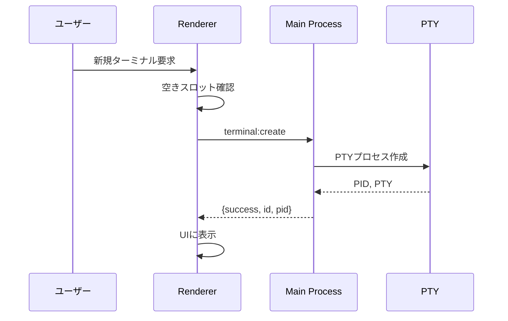

# ターミナル管理

> 🤖 **Claude Code最適化ドキュメント**  
> ZeamiTermのターミナル管理機能を完全解説。効率的なセッション管理を実現。

## 🎯 クイックリファレンス

| 機能 | 操作方法 | 実装箇所 |
|-----|---------|---------|
| 新規ターミナル作成 | `Cmd+T` | `ZeamiTermManager.js:123-234` |
| ターミナル切替 | `Cmd+Tab` | `SimpleLayoutManager.js:345-367` |
| レイアウト変更 | `Cmd+D` | `SimpleLayoutManager.js:156-189` |
| ターミナル終了 | `exit`コマンド | `terminalProcessManager.js:234-256` |

## 📋 ターミナル管理の概要

ZeamiTermは**固定2ターミナル構成**を採用：

```
Terminal A（メイン）     Terminal B（サブ）
- 削除不可              - 削除不可
- 常に存在              - 常に存在
- ID: terminal-a        - ID: terminal-b
```

この設計により：
- ✅ シンプルで予測可能な動作
- ✅ メモリ使用量の制御
- ✅ Claude Codeとの安定した通信

## 🏗️ ターミナルライフサイクル

### 作成フロー



### 実装詳細

```javascript
// 📍 src/renderer/core/ZeamiTermManager.js:123-234

async createTerminal(id = null) {
    // Terminal A/Bの特別処理
    if (!id) {
        if (!this.terminals.get('terminal-a')) {
            id = 'terminal-a';
        } else if (!this.terminals.get('terminal-b')) {
            id = 'terminal-b';
        } else {
            throw new Error('両方のターミナルが既に存在します');
        }
    }
    
    // バックエンドでPTY作成
    const result = await window.electronAPI.createTerminal({
        shell: this._getShell(),
        cwd: this._getCwd(),
        env: this._getEnv()
    });
    
    if (!result.success) {
        throw new Error(result.error);
    }
    
    // フロントエンドでxterm.js作成
    const terminal = new ZeamiTerminal({
        fontSize: 14,
        theme: this._getTheme()
    });
    
    // マップに保存
    this.terminals.set(id, terminal);
    
    return terminal;
}
```

## 🔄 セッション管理

### セッション状態の構造

```javascript
// 📍 セッションデータ形式
{
    "version": "1.0.0",
    "timestamp": 1634567890123,
    "terminals": {
        "terminal-a": {
            "buffer": "serialized buffer content",
            "cwd": "/home/user/projects",
            "env": {},
            "scrollback": 1234,
            "selection": null
        },
        "terminal-b": {
            "buffer": "serialized buffer content",
            "cwd": "/home/user",
            "env": {},
            "scrollback": 0,
            "selection": null
        }
    },
    "layout": {
        "type": "split",    // "tab" | "split"
        "splitPosition": 50,
        "activeTerminal": "terminal-a"
    },
    "profiles": {
        "lastUsed": "default"
    }
}
```

### 自動保存メカニズム

```javascript
// 📍 src/renderer/core/ZeamiTermManager.js:678-723

class SessionAutoSaver {
    constructor(termManager) {
        this.termManager = termManager;
        this.saveInterval = 30000; // 30秒
        this.isDirty = false;
        
        this._startAutoSave();
        this._setupChangeDetection();
    }
    
    _startAutoSave() {
        setInterval(() => {
            if (this.isDirty) {
                this._save();
                this.isDirty = false;
            }
        }, this.saveInterval);
    }
    
    _setupChangeDetection() {
        // ターミナル出力を監視
        this.termManager.terminals.forEach((terminal, id) => {
            terminal.onData(() => {
                this.isDirty = true;
            });
        });
        
        // レイアウト変更を監視
        this.termManager.layoutManager.on('change', () => {
            this.isDirty = true;
        });
    }
    
    async _save() {
        const sessionData = this._collectSessionData();
        await window.electronAPI.saveSession(sessionData);
    }
}
```

## 🎨 レイアウトシステム

### タブビューモード

```javascript
// 📍 src/renderer/core/SimpleLayoutManager.js:234-267

class TabView {
    render() {
        return `
            <div class="tab-container">
                <div class="tab-bar">
                    <div class="tab active" data-terminal="terminal-a">
                        <span class="tab-title">Terminal A</span>
                        <span class="tab-indicator">●</span>
                    </div>
                    <div class="tab" data-terminal="terminal-b">
                        <span class="tab-title">Terminal B</span>
                        <span class="tab-indicator">○</span>
                    </div>
                </div>
                <div class="terminal-container">
                    <!-- アクティブなターミナルのみ表示 -->
                </div>
            </div>
        `;
    }
}
```

### 分割ビューモード

```javascript
// 📍 垂直分割の実装
class SplitView {
    constructor() {
        this.splitPosition = 50; // パーセント
        this.minSize = 20; // 最小幅 20%
    }
    
    render() {
        return `
            <div class="split-container">
                <div class="split-pane left" style="width: ${this.splitPosition}%">
                    <div id="terminal-a-container"></div>
                </div>
                <div class="split-divider"></div>
                <div class="split-pane right" style="width: ${100 - this.splitPosition}%">
                    <div id="terminal-b-container"></div>
                </div>
            </div>
        `;
    }
    
    handleDividerDrag(event) {
        const container = this.container.getBoundingClientRect();
        const position = ((event.clientX - container.left) / container.width) * 100;
        
        this.splitPosition = Math.max(
            this.minSize, 
            Math.min(100 - this.minSize, position)
        );
        
        this.updateLayout();
        this.notifyTerminalsOfResize();
    }
}
```

## 🔧 高度な機能

### ターミナル間通信

```javascript
// 📍 メッセージ送信システム
class TerminalMessenger {
    sendToTerminal(fromId, toId, message) {
        const targetTerminal = this.terminals.get(toId);
        if (!targetTerminal) return;
        
        // メッセージフォーマット
        const formatted = `\x1b[33m[From ${fromId}]\x1b[0m ${message}\r\n`;
        targetTerminal.write(formatted);
    }
    
    broadcast(message) {
        this.terminals.forEach((terminal, id) => {
            terminal.write(`\x1b[35m[Broadcast]\x1b[0m ${message}\r\n`);
        });
    }
}
```

### フォーカス管理

```javascript
// 📍 src/renderer/core/FocusManager.js

class FocusManager {
    constructor(termManager) {
        this.termManager = termManager;
        this.focusedTerminal = null;
        
        this._setupFocusHandlers();
    }
    
    _setupFocusHandlers() {
        // グローバルキーハンドラー
        document.addEventListener('keydown', (e) => {
            // Cmd+Tab: ターミナル切替
            if ((e.metaKey || e.ctrlKey) && e.key === 'Tab') {
                e.preventDefault();
                this.switchTerminal();
            }
            
            // Cmd+1,2: 直接選択
            if ((e.metaKey || e.ctrlKey) && ['1', '2'].includes(e.key)) {
                e.preventDefault();
                const id = e.key === '1' ? 'terminal-a' : 'terminal-b';
                this.focusTerminal(id);
            }
        });
    }
    
    focusTerminal(id) {
        const terminal = this.termManager.terminals.get(id);
        if (!terminal) return;
        
        // 前のフォーカスを解除
        if (this.focusedTerminal) {
            this.focusedTerminal.blur();
        }
        
        // 新しいフォーカスを設定
        terminal.focus();
        this.focusedTerminal = terminal;
        
        // UIを更新
        this._updateUI(id);
    }
}
```

## 📊 ステータス表示

### ターミナル情報の表示

```javascript
// 📍 src/renderer/components/TerminalStatus.js

class TerminalStatus {
    constructor(terminalId) {
        this.terminalId = terminalId;
        this.element = this._createElement();
    }
    
    _createElement() {
        return `
            <div class="terminal-status">
                <span class="status-id">${this.terminalId}</span>
                <span class="status-shell">${this.shell}</span>
                <span class="status-cwd">${this.cwd}</span>
                <span class="status-size">${this.cols}×${this.rows}</span>
                <span class="status-pid">PID: ${this.pid}</span>
            </div>
        `;
    }
    
    update(info) {
        this.shell = info.shell;
        this.cwd = info.cwd;
        this.cols = info.cols;
        this.rows = info.rows;
        this.pid = info.pid;
        
        this._render();
    }
}
```

## ⚡ パフォーマンス最適化

### 非アクティブターミナルの処理

```javascript
// 📍 レンダリング最適化
class TerminalOptimizer {
    optimizeInactiveTerminal(terminal) {
        // レンダリングを一時停止
        terminal.options.rendererType = 'dom';
        
        // リフレッシュレートを下げる
        terminal.refresh(0, terminal.rows - 1);
        
        // イベントリスナーを最小限に
        terminal.clearAllListeners();
    }
    
    activateTerminal(terminal) {
        // WebGLレンダラーに戻す
        terminal.options.rendererType = 'webgl';
        
        // 通常のリフレッシュレート
        terminal.refresh(0, terminal.rows - 1);
        
        // イベントリスナーを復元
        this._restoreListeners(terminal);
    }
}
```

## 🐛 トラブルシューティング

### よくある問題

| 問題 | 原因 | 解決方法 |
|-----|------|---------|
| ターミナルが表示されない | レンダリングエラー | `terminal.reset()` |
| レイアウトが崩れる | リサイズイベント不足 | `fitAddon.fit()` |
| セッションが復元されない | 保存データ破損 | セッションクリア |
| フォーカスが効かない | イベントハンドラー競合 | リスナー再登録 |

### デバッグ方法

```javascript
// ターミナル状態の確認
console.log('Terminals:', Array.from(termManager.terminals.keys()));
console.log('Active:', termManager.layoutManager.activeTerminal);
console.log('Layout:', termManager.layoutManager.currentLayout);

// セッションデータの確認
const session = await window.electronAPI.loadSession();
console.log('Session:', session);
```

## 🔗 関連ドキュメント

- [レイアウトシステム詳細](../architecture/renderer-process.md#レイアウト管理)
- [セッション永続化](./session-persistence.md)
- [プロファイルシステム](./profile-system.md)

---

> 💡 **Claude Codeへのヒント**: Terminal A/Bは特別な存在で、決して削除してはいけません。新機能追加時は、この2ターミナル構成を前提に設計してください。