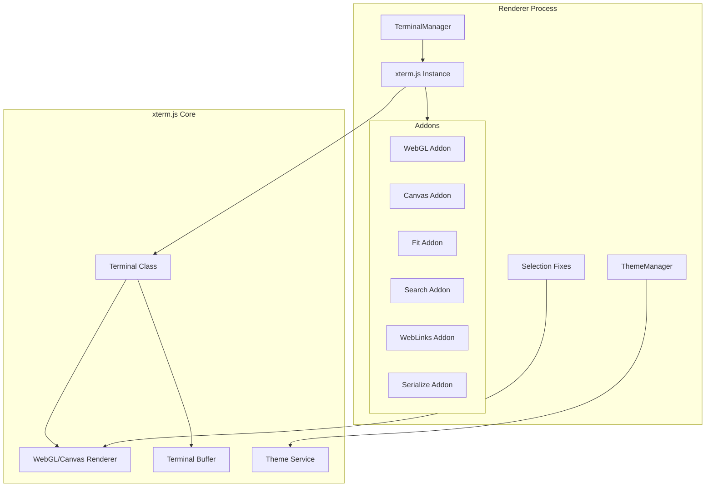

# xterm.js Integration Points

## Overview

このドキュメントは、ZeamiTermにおけるxterm.jsの統合ポイントを詳細に記録します。フォーク実装時の重要な参照資料となります。

## Integration Architecture



## 1. Terminal Creation Points

### terminalManager.js
```javascript
// xterm.js インポート
import { Terminal } from 'xterm'
import { FitAddon } from 'xterm-addon-fit'
import { SearchAddon } from 'xterm-addon-search'
import { WebLinksAddon } from 'xterm-addon-web-links'
import { SerializeAddon } from '@xterm/addon-serialize'
import { WebglAddon } from '@xterm/addon-webgl'
import { CanvasAddon } from '@xterm/addon-canvas'

// ターミナル作成
const terminal = new Terminal({
  theme: this.themeManager.getXtermTheme(),
  fontSize: 14,
  fontFamily: 'SF Mono, Monaco, Menlo, Consolas, "Courier New", monospace',
  allowTransparency: true,
  macOptionIsMeta: true,
  scrollback: 10000,
  cursorBlink: true,
  cursorStyle: 'block',
  drawBoldTextInBrightColors: false,
  minimumContrastRatio: 1
})
```

### index.js (Basic Implementation)
```javascript
// 基本的な実装
const terminal = new Terminal({
  theme: defaultTheme,
  fontSize: 14,
  fontFamily: 'Menlo, Monaco, "Courier New", monospace',
  cursorBlink: true
})
```

## 2. Addon Loading Points

### WebGL/Canvas Renderer Selection
```javascript
// terminalManager.js - レンダラー選択ロジック
try {
  const webglAddon = new WebglAddon()
  webglAddon.onContextLoss((e) => {
    console.warn('WebGL context lost, falling back to canvas')
    webglAddon.dispose()
    terminal.loadAddon(new CanvasAddon())
  })
  terminal.loadAddon(webglAddon)
} catch (e) {
  console.warn('WebGL not supported, using canvas renderer')
  terminal.loadAddon(new CanvasAddon())
}
```

### Addon Management
```javascript
// アドオンの保存と管理
this.terminals.set(terminalId, {
  terminal,
  fitAddon,
  searchAddon,
  webLinksAddon,
  serializeAddon,
  webglAddon: webglAddon || null,
  wrapper,
  tab
})
```

## 3. Theme Integration Points

### themeManager-v2.js
```javascript
// xterm.js テーマオブジェクト生成
getXtermTheme() {
  const colors = this.currentTheme.colors.terminal
  return {
    background: colors.background,
    foreground: colors.foreground,
    cursor: colors.cursor,
    cursorAccent: colors.cursorAccent,
    selectionBackground: colors.selectionBackground, // 透明度サポート
    black: colors.black,
    red: colors.red,
    // ... 他のANSI色
  }
}

// 既存ターミナルへのテーマ適用
updateTerminals(theme) {
  const xtermTheme = this.getXtermTheme()
  this.terminalManager.terminals.forEach(({ terminal }) => {
    terminal.options.theme = xtermTheme
  })
}
```

## 4. Selection Handling Modifications

### 選択色の問題と修正試行箇所

#### selection-fix-canvas.js
```javascript
// Canvas レンダラーへの直接介入試行
const canvasRenderer = terminal._core._renderService._renderer
canvasRenderer._selectionRenderModel.selectionBackgroundColor = 
  terminal._core._colorManager.colors.selectionBackgroundTransparent
```

#### selection-override.js
```javascript
// MutationObserver による DOM 監視
const observer = new MutationObserver((mutations) => {
  mutations.forEach((mutation) => {
    if (mutation.type === 'attributes' && 
        mutation.attributeName === 'style' &&
        target.classList.contains('xterm-selection')) {
      // 選択レイヤーのスタイル強制変更
    }
  })
})
```

#### terminal-patch.js
```javascript
// xterm.js 内部メソッドのオーバーライド
Terminal.prototype._createSelectionElement = function() {
  const el = document.createElement('div')
  el.className = 'xterm-selection'
  el.style.backgroundColor = 'rgba(120, 150, 200, 0.3)'
  return el
}
```

## 5. Event Handling Integration

### Input Handling
```javascript
// ユーザー入力の処理
terminal.onData((data) => {
  window.api.sendInput(terminalId, data)
})

// キーイベントのカスタマイズ
terminal.attachCustomKeyEventHandler((event) => {
  // Cmd+K でクリア
  if ((event.metaKey || event.ctrlKey) && event.key === 'k') {
    terminal.clear()
    return false
  }
  // Cmd+F で検索
  if ((event.metaKey || event.ctrlKey) && event.key === 'f') {
    showSearchBox(terminalId)
    return false
  }
  return true
})
```

### Selection Events
```javascript
// 選択変更の監視
terminal.onSelectionChange(() => {
  const selection = terminal.getSelection()
  if (selection) {
    navigator.clipboard.writeText(selection)
  }
})
```

### Resize Handling
```javascript
// ウィンドウリサイズ対応
const debouncedResize = debounce(() => {
  if (fitAddon) {
    fitAddon.fit()
    const { cols, rows } = terminal
    window.api.resizeTerminal(terminalId, cols, rows)
  }
}, 100)
```

## 6. Buffer and Data Management

### Data Writing
```javascript
// メインプロセスからのデータ受信
window.api.onTerminalData(terminalId, (data) => {
  const terminalData = this.terminals.get(terminalId)
  if (terminalData?.terminal) {
    terminalData.terminal.write(data)
  }
})
```

### Buffer Access
```javascript
// バッファ内容の取得（セッション保存用）
const serializeAddon = new SerializeAddon()
terminal.loadAddon(serializeAddon)
const serialized = serializeAddon.serialize()
```

## 7. Performance Optimizations

### Texture Atlas Configuration
```javascript
// WebGL テクスチャアトラス設定
terminal.options.drawBoldTextInBrightColors = false
terminal.options.minimumContrastRatio = 1
terminal.options.allowTransparency = true
```

### Scroll Performance
```javascript
// スクロール最適化
terminal.element.addEventListener('wheel', (e) => {
  if (e.shiftKey) {
    // Shift押下時は10倍速スクロール
    e.preventDefault()
    terminal.scrollLines(e.deltaY > 0 ? 10 : -10)
  }
}, { passive: false })
```

## 8. Lifecycle Management

### Terminal Disposal
```javascript
// 適切なクリーンアップ
disposeTerminal(terminalId) {
  const terminalData = this.terminals.get(terminalId)
  if (terminalData) {
    // アドオンの破棄
    terminalData.searchAddon?.dispose()
    terminalData.webglAddon?.dispose()
    terminalData.fitAddon?.dispose()
    
    // ターミナル本体の破棄
    terminalData.terminal.dispose()
    
    // DOM要素の削除
    terminalData.wrapper.remove()
    terminalData.tab.remove()
    
    // Mapから削除
    this.terminals.delete(terminalId)
  }
}
```

## 9. Custom CSS Integration

### Selection Style Overrides
```css
/* CSS での選択スタイル上書き試行 */
.xterm .xterm-selection {
  background-color: rgba(120, 150, 200, 0.3) !important;
  mix-blend-mode: multiply;
}

.xterm-selection-layer {
  opacity: 0.3 !important;
}
```

## 10. Critical Integration Files

### 最重要ファイル（フォーク時に注意）
1. **terminalManager.js** - メインの統合ポイント
2. **themeManager-v2.js** - テーマシステム統合
3. **selection-*.js** - 選択機能のカスタマイズ試行
4. **errorStateIndicator.js** - 出力インターセプト

### xterm.js 内部アクセス箇所
```javascript
// 内部APIへのアクセス（非推奨だが使用中）
terminal._core._renderService
terminal._core._colorManager
terminal._core.viewport
```

## フォーク実装時の注意点

### 1. 変更が必要な xterm.js ファイル
- `src/browser/services/ThemeService.ts` - selectionBackground 処理
- `src/browser/renderer/shared/CellColorResolver.ts` - 色解決ロジック
- `src/browser/renderer/webgl/WebglRenderer.ts` - WebGL選択レンダリング
- `src/browser/renderer/canvas/CanvasRenderer.ts` - Canvas選択レンダリング

### 2. API互換性の維持
- 公開APIは変更しない
- 内部APIの変更は最小限に
- アドオンシステムとの互換性維持

### 3. パフォーマンスへの配慮
- レンダリングパスへの変更は慎重に
- 選択処理のオーバーヘッド最小化
- メモリリークの防止

## まとめ

ZeamiTermは xterm.js を深く統合しており、特に以下の点で密結合しています：
1. レンダラー選択とフォールバック
2. テーマシステム（特に選択色）
3. アドオンによる機能拡張
4. イベントハンドリング
5. パフォーマンス最適化

フォーク実装により、これらの統合点でより深いカスタマイズが可能になります。