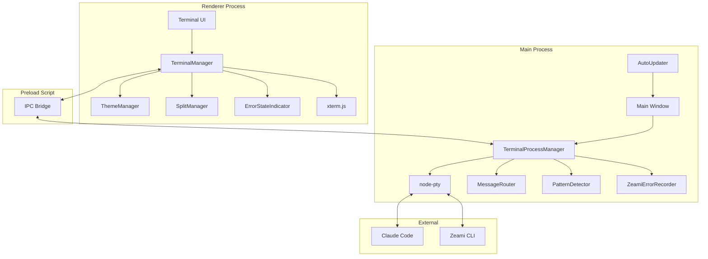

# ZeamiTerm Architecture Overview

## Executive Summary

ZeamiTermは、Claude Codeとの対話を強化するElectronベースのターミナルエミュレータです。xterm.js、node-pty、Electronの3つのコア技術を基盤とし、Zeamiエコシステムと深く統合されています。

## System Architecture



## Directory Structure

```
zeami-term/
├── src/
│   ├── main/                         # メインプロセス（Node.js環境）
│   │   ├── index.js                  # アプリケーションエントリポイント
│   │   ├── terminalProcessManager.js # ターミナルプロセス管理
│   │   ├── messageRouter.js          # メッセージルーティング
│   │   ├── patternDetector.js        # パターン検知エンジン
│   │   ├── zeamiErrorRecorder.js     # エラー記録・学習
│   │   ├── autoUpdater.js            # 自動更新機能
│   │   └── Various PTY implementations:
│   │       ├── simplePty.js          # 基本PTY実装
│   │       ├── robustPty.js          # 堅牢性強化版
│   │       ├── flowControlledPty.js  # フロー制御付き
│   │       └── finalPty.js           # 最終統合版
│   │
│   ├── renderer/                     # レンダラープロセス（ブラウザ環境）
│   │   ├── index.js                  # レンダラーエントリ
│   │   ├── terminalManager.js        # ターミナルUI管理
│   │   ├── themeManager-v2.js        # テーマシステムv2
│   │   ├── splitManager.js           # 分割ビュー管理
│   │   ├── errorStateIndicator.js    # エラー状態表示
│   │   └── themes/
│   │       └── default.json          # デフォルトテーマ
│   │
│   ├── preload/
│   │   └── index.js                  # コンテキストブリッジ
│   │
│   └── common/
│       └── ipcChannels.js            # IPC定義
│
├── scripts/                          # ビルド・自動化スクリプト
│   ├── automated-upstream-sync.js    # xterm.js同期
│   ├── create-release.js             # リリース作成
│   └── notarize.js                   # macOS公証
│
├── build-scripts/
│   └── skip-rebuild.js               # ビルド最適化
│
├── test/                             # テストスイート
│   └── terminal.test.js              # 基本テスト
│
└── docs/                             # ドキュメント
    ├── architecture/                 # アーキテクチャ文書
    ├── development/                  # 開発ガイド
    └── upstream-sync/                # 同期レポート
```

## Core Components

### 1. Main Process Components

#### TerminalProcessManager (`terminalProcessManager.js`)
- **責務**: PTYプロセスのライフサイクル管理
- **主要メソッド**:
  - `createTerminal()`: 新規ターミナル作成
  - `destroyTerminal()`: ターミナル破棄
  - `sendInput()`: ユーザー入力転送
- **通信**: IPCでレンダラーと通信

#### MessageRouter (`messageRouter.js`)
- **責務**: メッセージの補強・ルーティング
- **機能**:
  - Zeamiコマンドの検出
  - コンテキスト情報の付加
  - エラーパターンの識別

#### PatternDetector (`patternDetector.js`)
- **責務**: 出力パターンの検出・分析
- **検出パターン**:
  - エラーメッセージ
  - Zeamiコマンド出力
  - ファイルパス
  - URL

#### ZeamiErrorRecorder (`zeamiErrorRecorder.js`)
- **責務**: エラーパターンの記録・学習
- **機能**:
  - エラー収集
  - パターン分析
  - Zeami学習システムへの統合

### 2. Renderer Process Components

#### TerminalManager (`terminalManager.js`)
- **責務**: xterm.jsインスタンス管理
- **主要機能**:
  - ターミナルUI作成
  - テーマ適用
  - アドオン管理（WebGL、Fit、Search等）
  - IPC通信

#### ThemeManager-v2 (`themeManager-v2.js`)
- **責務**: テーマシステム管理
- **機能**:
  - VS Code風テーマ
  - 動的テーマ切り替え
  - カスタムカラー設定

#### SplitManager (`splitManager.js`)
- **責務**: 分割ビュー機能
- **機能**:
  - 水平/垂直分割
  - ペイン管理
  - フォーカス制御

#### ErrorStateIndicator (`errorStateIndicator.js`)
- **責務**: エラー状態の視覚的表示
- **機能**:
  - 接続エラー表示
  - エラーパターン別表示
  - 自動非表示

### 3. IPC Architecture

#### Channel Definitions (`ipcChannels.js`)
```javascript
// Main → Renderer
'terminal:data'          // ターミナル出力
'terminal:exit'          // プロセス終了
'error:detected'         // エラー検出
'pattern:matched'        // パターンマッチ
'zeami:suggestion'       // Zeami提案

// Renderer → Main
'terminal:create'        // ターミナル作成
'terminal:input'         // ユーザー入力
'terminal:resize'        // サイズ変更
'terminal:destroy'       // ターミナル破棄
'zeami:execute'          // Zeamiコマンド実行
```

## Data Flow

### 1. Input Flow
```
User Keystroke
    ↓
xterm.js (Renderer)
    ↓
IPC: 'terminal:input'
    ↓
TerminalProcessManager (Main)
    ↓
node-pty
    ↓
Claude Code / Shell Process
```

### 2. Output Flow
```
Process Output
    ↓
node-pty
    ↓
PatternDetector
    ↓
MessageRouter
    ↓
IPC: 'terminal:data'
    ↓
TerminalManager
    ↓
xterm.js Display
```

### 3. Error Detection Flow
```
Error Output
    ↓
PatternDetector
    ↓
ZeamiErrorRecorder
    ↓
Zeami Learn System
    ↓
Error Pattern Database
```

## Technology Stack Details

### Core Dependencies
- **Electron**: v28.3.3 - クロスプラットフォームデスクトップアプリ
- **xterm.js**: v5.3.0 - ターミナルエミュレータUI
- **node-pty**: v0.10.1 - 疑似ターミナル実装

### xterm.js Addons
- **@xterm/addon-webgl**: v0.18.0 - WebGLレンダリング
- **@xterm/addon-canvas**: v0.7.0 - Canvas fallback
- **xterm-addon-fit**: v0.8.0 - 自動サイズ調整
- **xterm-addon-search**: v0.13.0 - 検索機能
- **xterm-addon-web-links**: v0.9.0 - リンククリック

### Build & Distribution
- **electron-builder**: v26.0.12 - パッケージング
- **@electron/notarize**: v2.5.0 - macOS公証
- **electron-updater**: v6.6.2 - 自動更新

## Security Architecture

### Context Isolation
```javascript
// Main window configuration
{
  webPreferences: {
    contextIsolation: true,
    nodeIntegration: false,
    sandbox: true,
    preload: path.join(__dirname, '../preload/index.js')
  }
}
```

### IPC Security
- 限定的なチャンネル公開
- 入力検証
- サニタイゼーション

## Performance Optimizations

### 1. Rendering
- WebGL使用によるGPUアクセラレーション
- Canvas fallbackサポート
- 仮想スクロール

### 2. Process Management
- PTYバッファリング最適化
- フロー制御
- メモリ管理

### 3. Update Strategy
- 差分更新
- バックグラウンドダウンロード
- 段階的ロールアウト

## Future Architecture Considerations

### xterm.js Fork Integration
- ソースレベルでのカスタマイズ
- 選択色透明化の根本解決
- Zeami専用拡張の実装

### AI Integration Points
- リアルタイムコード分析
- 予測的コマンド補完
- コンテキスト認識型提案

### Performance Enhancements
- ワーカースレッド活用
- WASM統合検討
- より効率的なIPC

## Conclusion

ZeamiTermは、モダンなElectronアーキテクチャに基づき、セキュリティとパフォーマンスを重視した設計となっています。xterm.jsのフォークにより、さらなるカスタマイズと最適化の可能性が開かれています。